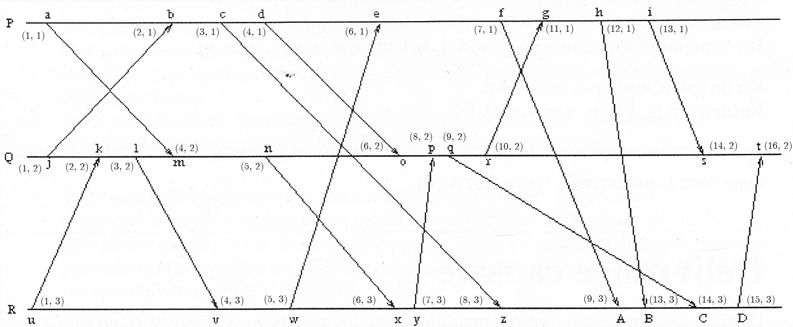
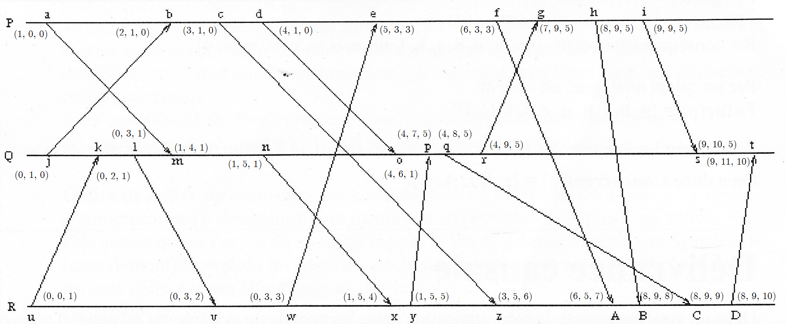

# Algorithmes distribués

## À propos

Ce document reprend les notes du cours d'Algorithmes distribués dispensées par **Mme Stella MARC-ZWECKER** à *l'Université de Strasbourg*. Le contenu s'appuyant sur les textes d'origine consultables [sur la plateforme *Moodle* de l'université](https://moodle3.unistra.fr/course/view.php?id=2687) ou [sur la page officielle de l'enseignant](http://dpt-info.u-strasbg.fr/~stella/enseignement/page_accueil.html) a été synthétisé et enrichi des informations complémentaires et des exemples illustrés présentés durant les séances de cours.

Mise en forme par [Marek Felsoci](mailto:marek.felsoci@etu.unistra.fr).

**ATTENTION !** L'USAGE DE CE RÉSUMÉ DE COURS NE PEUT ÊTRE QU'ACADÉMIQUE.

## Crédits

Support de cours d'Algorithmes distribués, [Stella MARC-ZWECKER](http://dpt-info.u-strasbg.fr/~stella/), [Université de Strasbourg](http://www.unistra.fr/index.php?id=accueil), 2017 [https://moodle3.unistra.fr/course/view.php?id=2687, http://dpt-info.u-strasbg.fr/~stella/enseignement/page_accueil.htm]

## 1 Introduction

### 1.1 Concept de système distribué

Il est nécessaire de bien faire la différence entre une machine parallèle et un système distribué. Le traitement parallèle de données s'effectue au sein d'une même machine comme par exemple à l'aide de la technique *SIMD (voir la taxonomie de Flynn)* caractérisée par un fort degré de synchronisation. *A contrario* un système distribué est composé de plusieurs entités de calcul autonomes distantes. Il n'emploi pas de mémoire commune et des communications se voient asynchrones à l'aide d'échange de messages.

### 1.2 Intérêt du calcul distribué

#### 1.2.1 Augmentation de la puissance de calcul

On y procède par regroupement d'ensembles d'entités existantes. On parle alors soit d'une **grappe de serveurs** que l'on appelle *clusters* formant des ensembles de **machines homogènes et localisées** soit de **grilles** ou bien *grids* qui sont des ensembles de **ressources hétérogènes et délocalisées.**

Cette montée en puissance de calcul est très exploitée dans le domaine de traitement de grandes quantités de données - *Big Data.*

#### 1.2.2 Communication entre entités distantes

Assurée par des protocole de réseau tels que *LAN, Wi-Fi, réseau mobile, etc.* elle met en rapport des banques de données réparties (transactions, *streaming*, échanges *peer-to-peer*, etc.)

### 1.3 Mise en &oelig;uvre des systèmes distribués

Dans les systèmes distribués on appelle *les processeurs* **les entités de calcul** que l'on trouve dans les tablettes, les ordinateurs, les drônes et d'autres dispositifs.

Pour communiquer entre eux les processeurs utilisent deux grands modes de communication.

#### 1.3.1 Passage de messages &laquo; *message passing* &raquo;

Il s'agit tout simplement d'envois et de réceptions de messages.

#### 1.3.2 Mémoire partagée &laquo; *shared memory* &raquo;

Dans ce cas, les processeurs ne communiquent pas directement mais à travers d'une mémoire ou des variables communes où ils peuvent tous lire ou écrire. On parle alors d'une simulation du calcul distribué à envoi coûteux.

### 1.4 Caractéristiques des systèmes distribués

#### 1.4.1 Caractéristiques générales

Les systèmes distribués il n'existe pas d'état global ni de temps dit *absolu*. Un processus ne perçoit alors que des **événements locaux** dont il est le siège et ceux issus des **relations de causalité** entre l'émission et la réception d'un même message. Dans la suite on va alors parler d'un temps *logique*.

**En absence de temps absolu il est impossible d'ordonner deux événements quelconques !**

#### 1.4.2 Distribution des données

Les données peuvent être distribuées de deux manières :

* **duplication**
	Une donnée *x* est recopiée en *n* exemplaires sur *n* sites. Il est alors impératif d'assurer la cohérence mutuelle de ces copies.
* **partitionnement**
	Une donnée *x* est partitionnée en *n* exemplaires se répartis entre *n* sites.

#### 1.4.3 Distribution du contrôle

Le contrôle est distribué de sorte qu'il n'y aie **pas de relation hiérarchique** entre les processus. On emploie alors la notion du **privilège alterné** dit aussi du *maître* temporaire.

### 1.5 &Eacute;léments de l'algorithmique distribuée

#### 1.5.1 Processus

Les processus sont des programmes qui s'exécutent. Ils sont dotés d'une structure de contrôle non-déterministe ce qui signifie :

* attente de plusieurs événements possibles
* modélisation par **automates à états finis**

#### 1.5.2 Voies de communication

##### Propriétes structurelles des liaisons

Il existe différentes structures de liaisons possibles :

* **anneau** : structure en boucle
* **étoile** : structure centralisée
* **arbre** : structure hiérarchisée
* **maillage complet** : structure fortement connexe

Ici on parle de structures logicielles.

##### Propriétes comportementales des liaisons

**Hypothèses sur le comportement des voies de communication :**

* **H1** : transmission sans duplication de messages
* **H2** : transmission sans altération de messages
* **H3** : pas de déséquencement de messages
* **H4** : délai d'acheminement des messages fini (pas de perte)
* **H5** : délai d'acheminement des messages borné (détection de pertes possible)

Ces hypothèses sont mises en &oelig;uvre à l'aide de couches logicielles.

### 1.6 Qualités d'un algorithme distribué

#### 1.6.1 Degré de répartition

Les degrés de symétrie permettent de définir le degré de répartition du contrôle :

* **non-symétrie** : chaque processus exécute un texte différent
* **symétrie de texte** : les processus exécutent le même texte qui dépend de l'identité du processus exécutant (comportement différent en fonction des processus)
* **symétrie forte** : les processus exécutent le même texte sans rôle spécifique (sans identité)

#### 1.6.2 Résistance aux pannes

Ce critère est directement lié à la symétrie. Plus le degré de répartition est élevé et plus un algorithme est résistant.

#### 1.6.3 Hypothèses sur le réseau

Moins d'hypothèses sur les voies de communication sont implémentées par un algorithme et moins il est difficile de mettre en &oelig;uvre.

#### 1.6.4 Traffic engendré

La performance se mesure par :

* le nombre de messages échangés
* la charge induite sur les voies
* le temps d'attente dans les processus

### 1.7 Types d'algorithmes distribués

* **calcul diffusant**
	La solution de Dijkstra et de Scholten emploie la topologie d'*arbre* ainsi que des *algorithmes de terminaison et de détection d'interblocage*.
* **jeton circulant**
	Cette méthode met en &oelig;uvre la topologie d'*anneau* tout en utilisant des *algorithmes d'exclusion mutuelle, d'élection et de terminaison*.
* **estampillage ou horloge logique**
	La technique est utilisable sur tout les types de topologie.

#### 1.7.1 Horloges logiques

Une horloge logique permet de définir un **ordre total** *(ordre des événements vu de la même manière par tous les sites d'un système)* entre tous les événements pour permettre un fonctionnement équitable. Pour ce faire, on emploie des algorithmes d'exclusion mutuelle et de calcul d'un état global.

## 2 Temps logique

Il s'agit de déterminer un ordre des événements et de mettre en &oelig;uvre des concepts d'ordre et de délivrance causale de Riflet à l'aide d'horloges et d'estampilles.

### 2.1 Ordre causal

#### 2.1.1 Relation de précédence directe

Un événement *e* **précède directement** un événement *e'* : *e* &rarr; *e'* si l'une des conditions suivantes est vraie :

1. les événements *e* et *e'* ont lieu **dans le même processus**, et *e* se produit **exactement avant** *e'* sur ce processus
2. l'événement *e* correspond à **l'envoi d'un message** par un processus, et l'événement *e'* correspond à la **réception du même message** par un autre processus

#### 2.1.2 Relation de précédence causale

Cette relation est définie comme **la fermeture réflexive et transitive** de la relation de précédence directe. Un événement *e* **précède causalement** un événement *e'* si et seulement si une des conditions suivantes est vraie :

1. *e = e'* : **réflexivité**
2. &exist; *e1, e2, ..., em* tels que *e1 = e* et *em = e'* et &forall;i *ei &rarr; ei + 1* : **transitivité**

Cette relation définit un **ordre partiel** des événements.

#### 2.1.3 Événements concurrents

Si deux événements *x* et *y* se produisent dans des processus différents, il se peut qu'aucune des deux relations de précédence ne soit vraie.

De tels événements *x* et *y*, non comparable par la relation de précédence causale, sont dits **concurrents** et notés *x* || *y*.

#### 2.1.4 Ensembles d'événements

À un événement *e* on peut associer trois ensembles d'événements :

* **passé** : ensemble des événements antérieurs à *e* dans l'ordre causal (*e* inclu)
* **futur** : ensemble des événements postérieurs à *e* dans l'ordre causal (*e* inclu)
* **concurrent** : ensemble des événements concurrents avec *e* dans l'ordre causal

##### Exemple des ensembles d'événements

**Énoncé** : Déterminer les événements passés, futurs et concurrents par rapport à l'événement *p*.

### 2.2 Livraison causale

La livraison d'un message *m*, notée *del(m)*, est l'opération consistant à le rendre accessible aux applications utilisatrices. Elle peut être retardée lors de la réception de *m* pour garantir un ordre de livraison souhaité.

#### 2.2.1 Ordre de livraison FIFO &laquo; *First In First Out* &raquo;

Si deux messages sont envoyés successivement depuis un même site *Si* vers un même destinataire *Sj* alors le premier sera délivré sur le site *Sj* avant le second :

> sndi(m1, j) &rarr; sndi(m2, j) &rArr; delj(m1) &rarr; delj(m2)

En cas de non-respect de la relqtion précédente, c'est-à-dire lorsque le message *m2* arrive plutôt sur le site *Sj*, sa livraison doit être retardée jusqu'à ce que le message *m1* et soit livré. Par conséquent la couche de communication doit disposer d'un **tampon ordonné** permettant de stocker les messages en attente.

#### 2.2.2 Ordre de livraison causal

Cette propriété étend l'odre de livraison FIFO à des communications à destion d'un même site en provenance de plsuieurs autres sites.

Si l'envoi d'un message *m1* par le site *Si* à destination du site *Sk* précède causalement l'envoi du message *m2* par le site *Sj* à destination du site *Sk*, alors le message *m1* sera délivré avant le message *m2* sur le site *Sk* :

> sndi(m1, k) &rarr; sndj(m2, k) &rArr; delk(m1) &rarr; delk(m2)

### 2.3 Horloges et estampilles scalaires

Les processus qui interagissent doivent s'accorder sur l'ordre dans lequel les événements se produisent autrement dit **se synchroniser**.

#### 2.3.1 Définition et principe des estampilles scalaires

Soient *HLi* l'horloge du site *Si*, *HLe* la date de l'événement *e* et notons &sube; l'ordre des estampilles.  Si les sites datent les événements au moyen d'horloges et si ces dernières sont utilisées pour dater les événements, elles doivent pouvoir être comparées de telle manière que :

> e &rarr; e' &rArr; HLe &sube; HLe'

##### Algorithme de Lamport

1. Si un événement **local** se produit sur le site *Si*, *HLi* est incrémentée.
2. Si un événement correspondant à **l'envoi** d'un message se produit sur le site *Si*, *HLi* est incrémentée, et le message *m* est envoyé avec la nouvelle valeur de *HLi* comme estampille *ELm*.
3. Si un événement correspondant à **la réception** d'un message *m* d'estampille *ELm* se produit sur le site *Si*, son horloge locale est mise à jour de telle sorte que *HLi = max(HLi, ELm) + 1*.

#### 2.3.2 Propriétés des estampilles scalaires

##### Ordre non-strict des événements

Ce qui signifie que plusieurs événements peuvent porter la même valeur. Pour rendre cet ordre strict on adjoint à la valeur de l'horloge logique d'un site l'identificateur de ce dernier. Ainsi l'estampille logique *HLe* d'un événement *e* du site *Si* est un couple *(HLi, i)*. Par conséquent on a:

> (HLi, i) &sub; (HLj, j) &hArr; HLi < HLj &or; (HLi = HLj &and; i < j)

##### Ordre total des événements

Cet ordre induit une chaîne de tous les événements.

##### Exemple d'un système synchronisé à l'aide des horloges scalaires

L'inconvénient des estampilles scalaires est l'ordonnancement artificiel des événements concurrents. Par exemple, on déduit du schéma précédent que *p* et *e* sont deux événements concurrents pourtant les estampilles ne nous permettent pas de le dire.

### 2.4 Horloges et estampilles vectorielles

#### 2.4.1 Définition et principe des estampilles vectorielles

* Chaque site gère une horloge vectorielle constituée de *n* entiers correspondant aux *n* sites du système.
* Les messages envoyés par un site sont estampillés en utilisant la valeur courante de l'horloge vectorielle.
* La réception d'un message permet au site récepteur de synchroniser son horloge vectorielle avec celle du site émetteur.

##### Algorithme de Mattern

Soient *HVi* l'horloge vectorielle du site *Si* et *EVm* l'estampille vectorielle attribuée au message *m* lors de son envoi.

1. Si un événement **local** se produit sur le site *Si*, *HVi[i]* est incrémentée.
2. Si un événement correspondant à **l'envoi** d'un message se produit sur le site *Si*, *HVi[i]* est incrémentée, et le message *m* est envoyé avec la nouvelle valeur de *HVi* comme estampille *EVm*.
3. Si un message *m* d'estampille *EVm* est reçu sur le site *Si* alors *HVi[i]* est incrémentée et &forall; *j &ne; i, HVi[j] = max(HVi[i], EVm[j])*.

#### 2.4.2 Propriétés des estampilles vectorielles

##### Propriété fondamentale

Si *EVe* est l'estampille vectorielle de *e* alors sa ième valeur correspond au **nombre d'événements du site *Si*** qui appartiennent au **passé de *e***.

##### Relation d'ordre

Si *EVe* est l'estampille vectorielle de *e* alors on a :

> EVe &sube; EVe' &hArr; &forall; i, EVe[i] &le; EVe'[i]

Cette relation reflète exactement la relation de précédence causale entre événements. De plus, si deux événements sont incomparables on peut en déduire qu'ils sont concurrents.

Les estampilles vectorielles ne permettent pas de garantir une livraison causale des messages.

Sur le schéma ci-dessus on peut voir que le message *m3* est reçu trop tôt. En effet sa livraison devrait être retardée jusqu'à ce que le message *m1* soit arrivé et livré.

Cependant l'horloge vectorielle permet de détecter le non-respect de l'ordre causal de la livraison des messages *m1* et *m3 a posteriori*. Étant donné que l'estampille porté par le message *m1* est *(4, **8**, 5)* et l'horloge vectorielle du site *SR* vaut *(8, **9**, 8)* au moment de la réception de *m1* il est possible de voir que l'événement *q* correspondant à l'envoi du message *m1* s'est produit plus tôt que l'événement *h* qui correspond à l'envoi du message *m3*.

### 2.5 Horloges et estampilles matricielles

#### 2.5.1 Principe des estampilles matricielles

Dans un système à *n* sites, les horloges d'un site *Si* et les estampilles des événements et des messages sont des matrices carrées d'ordre *n*.

Soient *HMi* l'horloge matricielle du site *Si* et *EMm* l'estampille matricielle d'un message *m*. Sur le site *Si*, la matrice *HMi* va mémoriser:

* le nombre de messages que le site *Si* a envoyé aux autres sites *(voir ième ligne de la matrice)*
* pour chacun des autres sites, le nombre de messages émis par ces derniers dont le site *Si* a connaissance *(voir la ligne de la matrice correspodant au site en question)*

Ainsi sur le site *Si*, la valeur de *EMi[j, k]* donne le nombre de messages en provenance du site *Sj* livrables sur le site *Sk* dont le site *Si* a connaissance.

**La diagonale** de *HMi* correspond à son **estampille vectorielle** et représente la connaissance qu'a le site *Si* du nombre d'événements locaux qui se sont déjà produits sur les différents sites.

##### Algorithme de synchronisation

1. Lorsqu'un événement **local** se produit sur le site *Si* alors *HMi[i, i]* est incrémenté.
2. Lorsqu'un message est **envoyé** du site *Si* vers le site *Sj* alors *HMi[i, i]* et *HMi[i, j]* sont incrémentés.
3. Lorsqu'un message *m* en provenance du site *Sj* est **reçu** par le site *Si*, il faut s'assurer que tous les messages envoyés antérieurement vers le site *Si* sont effectivement arrivés. Cela suppose donc que le site *Si* ait reçu d'une part tous les messages en provenance du site *Sj* et d'autre part tous les messages envoyés depuis les autres sites du système. Les conditions suivantes doivent être alors vérifiées dans l'ordre :
	* *EMm[j, i] = HMi[j, i] + 1* : ordre FIFO sur le canal *(j, i)*
	* &forall; *k | k &ne; i &and; k &ne; j, *EMm[k, i] &le; HMi[k, i]* : tous les messages en provenances des autres sites ont été reçus
4. Une fois ces conditions vérifiées, le message est **livrable** et l'horloge du site *Si* est mise à jour :
	* *HMi[i, i]* et *HMi[j, i]* sont incrémentés
	* pour le reste de la matrice : *HMi[k, l] = max(HMi[k, l], EMm[k, l])*
5. Dans le cas contraire, la livraison du message est **retardée** jusqu'à ce que les conditions soient vérifiées et l'horloge reste intacte.
6. La livraison d'un message pourra ainsi provoquer celle des messages arrivés prématurément (reatrdés).

##### Exemple d'un système synchronisé à l'aide des horloges matricielles

