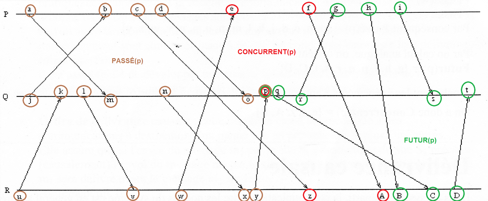
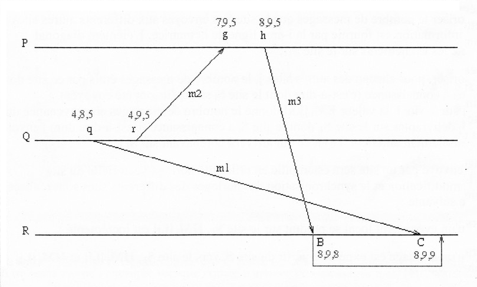

# Algorithmes distribués

Mise en forme par [Marek Felsoci](mailto:marek.felsoci@etu.unistra.fr).

**L'USAGE DE CE RÉSUMÉ DE COURS NE PEUT ÊTRE QU'ACADÉMIQUE**

## Crédits

Ce résumé s'appuie sur les notes et les supports du cours d'Algorithmes distribués dispensé par Stella MARC-ZWECKER à l'Université de Strasbourg consultables [sur la page officielle de l'enseignant](http://dpt-info.u-strasbg.fr/~stella/enseignement/page_accueil.html).

## 1 Introduction

### 1.1 Concept de système distribué

Il est nécessaire de bien faire la différence entre une machine parallèle et un système distribué. Le traitement parallèle de données s'effectue au sein d'une même machine comme par exemple à l'aide de la technique *SIMD (voir la taxonomie de Flynn)* caractérisée par un fort degré de synchronisation. *A contrario* un système distribué est composé de plusieurs entités de calcul autonomes distantes. Il n'emploi pas de mémoire commune et des communications se voient asynchrones à l'aide d'échange de messages.

### 1.2 Intérêt du calcul distribué

#### 1.2.1 Augmentation de la puissance de calcul

On y procède par regroupement d'ensembles d'entités existantes. On parle alors soit d'une **grappe de serveurs** que l'on appelle *clusters* formant des ensembles de **machines homogènes et localisées** soit de **grilles** ou bien *grids* qui sont des ensembles de **ressources hétérogènes et délocalisées.**

Cette montée en puissance de calcul est très exploitée dans le domaine de traitement de grandes quantités de données - *Big Data.*

#### 1.2.2 Communication entre entités distantes

Assurée par des protocole de réseau tels que *LAN, Wi-Fi, réseau mobile, etc.* elle met en rapport des banques de données réparties (transactions, *streaming*, échanges *peer-to-peer*, etc.)

### 1.3 Mise en &oelig;uvre des systèmes distribués

Dans les systèmes distribués on appelle *les processeurs* **les entités de calcul** que l'on trouve dans les tablettes, les ordinateurs, les drônes et d'autres dispositifs.

Pour communiquer entre eux les processeurs utilisent deux grands modes de communication.

#### 1.3.1 Passage de messages &laquo; *message passing* &raquo;

Il s'agit tout simplement d'envois et de réceptions de messages.

#### 1.3.2 Mémoire partagée &laquo; *shared memory* &raquo;

Dans ce cas, les processeurs ne communiquent pas directement mais à travers d'une mémoire ou des variables communes où ils peuvent tous lire ou écrire. On parle alors d'une simulation du calcul distribué à envoi coûteux.

### 1.4 Caractéristiques des systèmes distribués

#### 1.4.1 Caractéristiques générales

Les systèmes distribués il n'existe pas d'état global ni de temps dit *absolu*. Un processus ne perçoit alors que des **événements locaux** dont il est le siège et ceux issus des **relations de causalité** entre l'émission et la réception d'un même message. Dans la suite on va alors parler d'un temps *logique*.

**En absence de temps absolu il est impossible d'ordonner deux événements quelconques !**

#### 1.4.2 Distribution des données

Les données peuvent être distribuées de deux manières :

* **duplication**
	Une donnée *x* est recopiée en *n* exemplaires sur *n* sites. Il est alors impératif d'assurer la cohérence mutuelle de ces copies.
* **partitionnement**
	Une donnée *x* est partitionnée en *n* exemplaires se répartis entre *n* sites.

#### 1.4.3 Distribution du contrôle

Le contrôle est distribué de sorte qu'il n'y aie **pas de relation hiérarchique** entre les processus. On emploie alors la notion du **privilège alterné** dit aussi du *maître* temporaire.

### 1.5 &Eacute;léments de l'algorithmique distribuée

#### 1.5.1 Processus

Les processus sont des programmes qui s'exécutent. Ils sont dotés d'une structure de contrôle non-déterministe ce qui signifie :

* attente de plusieurs événements possibles
* modélisation par **automates à états finis**

#### 1.5.2 Voies de communication

##### Propriétes structurelles des liaisons

Il existe différentes structures de liaisons possibles :

* **anneau** : structure en boucle
* **étoile** : structure centralisée
* **arbre** : structure hiérarchisée
* **maillage complet** : structure fortement connexe

Ici on parle de structures logicielles.

##### Propriétes comportementales des liaisons

**Hypothèses sur le comportement des voies de communication :**

* **H1** : transmission sans duplication de messages
* **H2** : transmission sans altération de messages
* **H3** : pas de déséquencement de messages
* **H4** : délai d'acheminement des messages fini (pas de perte)
* **H5** : délai d'acheminement des messages borné (détection de pertes possible)

Ces hypothèses sont mises en &oelig;uvre à l'aide de couches logicielles.

### 1.6 Qualités d'un algorithme distribué

#### 1.6.1 Degré de répartition

Les degrés de symétrie permettent de définir le degré de répartition du contrôle :

* **non-symétrie** : chaque processus exécute un texte différent
* **symétrie de texte** : les processus exécutent le même texte qui dépend de l'identité du processus exécutant (comportement différent en fonction des processus)
* **symétrie forte** : les processus exécutent le même texte sans rôle spécifique (sans identité)

#### 1.6.2 Résistance aux pannes

Ce critère est directement lié à la symétrie. Plus le degré de répartition est élevé et plus un algorithme est résistant.

#### 1.6.3 Hypothèses sur le réseau

Moins d'hypothèses sur les voies de communication sont implémentées par un algorithme et moins il est difficile de mettre en &oelig;uvre.

#### 1.6.4 Traffic engendré

La performance se mesure par :

* le nombre de messages échangés
* la charge induite sur les voies
* le temps d'attente dans les processus

### 1.7 Types d'algorithmes distribués

* **calcul diffusant**
	La solution de Dijkstra et de Scholten emploie la topologie d'*arbre* ainsi que des *algorithmes de terminaison et de détection d'interblocage*.
* **jeton circulant**
	Cette méthode met en &oelig;uvre la topologie d'*anneau* tout en utilisant des *algorithmes d'exclusion mutuelle, d'élection et de terminaison*.
* **estampillage ou horloge logique**
	La technique est utilisable sur tout les types de topologie.

#### 1.7.1 Horloges logiques

Une horloge logique permet de définir un **ordre total** *(ordre des événements vu de la même manière par tous les sites d'un système)* entre tous les événements pour permettre un fonctionnement équitable. Pour ce faire, on emploie des algorithmes d'exclusion mutuelle et de calcul d'un état global.

## 2 Temps logique

Il s'agit de déterminer un ordre des événements et de mettre en &oelig;uvre des concepts d'ordre et de délivrance causale de Riflet à l'aide d'horloges et d'estampilles.

### 2.1 Ordre causal

#### 2.1.1 Relation de précédence directe

Un événement *e* **précède directement** un événement *e'* : *e* &rarr; *e'* si l'une des conditions suivantes est vraie :

1. les événements *e* et *e'* ont lieu **dans le même processus**, et *e* se produit **exactement avant** *e'* sur ce processus
2. l'événement *e* correspond à **l'envoi d'un message** par un processus, et l'événement *e'* correspond à la **réception du même message** par un autre processus

#### 2.1.2 Relation de précédence causale

Cette relation est définie comme **la fermeture réflexive et transitive** de la relation de précédence directe. Un événement *e* **précède causalement** un événement *e'* si et seulement si une des conditions suivantes est vraie :

1. *e = e'* : **réflexivité**
2. &exist; *e<sub>1</sub>, e<sub>2</sub>, ..., e<sub>m</sub>* tels que *e<sub>1</sub> = e* et *e<sub>m</sub> = e'* et &forall;<sub>i</sub> *e<sub>i</sub> &rarr; e<sub>i + 1</sub>* : **transitivité**

Cette relation définit un **ordre partiel** des événements.

#### 2.1.3 Événements concurrents

Si deux événements *x* et *y* se produisent dans des processus différents, il se peut qu'aucune des deux relations de précédence ne soit vraie.

De tels événements *x* et *y*, non comparable par la relation de précédence causale, sont dits **concurrents** et notés *x* || *y*.

#### 2.1.4 Ensembles d'événements

À un événement *e* on peut associer trois ensembles d'événements :

* **passé** : ensemble des événements antérieurs à *e* dans l'ordre causal (*e* inclu)
* **futur** : ensemble des événements postérieurs à *e* dans l'ordre causal (*e* inclu)
* **concurrent** : ensemble des événements concurrents avec *e* dans l'ordre causal

##### Exemple des ensembles d'événements

**Énoncé** : Déterminer les événements passés, futurs et concurrents par rapport à l'événement *p*.



### 2.2 Livraison causale

La livraison d'un message *m*, notée *del(m)*, est l'opération consistant à le rendre accessible aux applications utilisatrices. Elle peut être retardée lors de la réception de *m* pour garantir un ordre de livraison souhaité.

#### 2.2.1 Ordre de livraison FIFO &laquo; *First In First Out* &raquo;

Si deux messages sont envoyés successivement depuis un même site *S<sub>i</sub>* vers un même destinataire *S<sub>j</sub>* alors le premier sera délivré sur le site *S<sub>j</sub>* avant le second :

> snd<sub>i</sub>(m<sub>1</sub>, j) &rarr; snd<sub>i</sub>(m<sub>2</sub>, j) &rArr; del<sub>j</sub>(m<sub>1</sub>) &rarr; del<sub>j</sub>(m<sub>2</sub>)

En cas de non-respect de la relqtion précédente, c'est-à-dire lorsque le message *m<sub>2</sub>* arrive plutôt sur le site *S<sub>j</sub>*, sa livraison doit être retardée jusqu'à ce que le message *m<sub>1</sub>* et soit livré. Par conséquent la couche de communication doit disposer d'un **tampon ordonné** permettant de stocker les messages en attente.

#### 2.2.2 Ordre de livraison causal

Cette propriété étend l'odre de livraison FIFO à des communications à destion d'un même site en provenance de plsuieurs autres sites.

Si l'envoi d'un message *m<sub>1</sub>* par le site *S<sub>i</sub>* à destination du site *S<sub>k</sub>* précède causalement l'envoi du message *m<sub>2</sub>* par le site *S<sub>j</sub>* à destination du site *S<sub>k</sub>*, alors le message *m<sub>1</sub>* sera délivré avant le message *m<sub>2</sub>* sur le site *S<sub>k</sub>* :

> snd<sub>i</sub>(m<sub>1</sub>, k) &rarr; snd<sub>j</sub>(m<sub>2</sub>, k) &rArr; del<sub>k</sub>(m<sub>1</sub>) &rarr; del<sub>k</sub>(m<sub>2</sub>)

### 2.3 Horloges et estampilles scalaires

Les processus qui interagissent doivent s'accorder sur l'ordre dans lequel les événements se produisent autrement dit **se synchroniser**.

#### 2.3.1 Définition et principe des estampilles scalaires

Soient *HL<sub>i</sub>* l'horloge du site *S<sub>i</sub>*, *HL<sub>e</sub>* la date de l'événement *e* et notons &sube; l'ordre des estampilles.  Si les sites datent les événements au moyen d'horloges et si ces dernières sont utilisées pour dater les événements, elles doivent pouvoir être comparées de telle manière que :

> e &rarr; e' &rArr; HL<sub>e</sub> &sube; HL<sub>e'</sub>

##### Algorithme de Lamport

1. Si un événement **local** se produit sur le site *S<sub>i</sub>*, *HL<sub>i</sub>* est incrémentée.
2. Si un événement correspondant à **l'envoi** d'un message se produit sur le site *S<sub>i</sub>*, *HL<sub>i</sub>* est incrémentée, et le message *m* est envoyé avec la nouvelle valeur de *HL<sub>i</sub>* comme estampille *EL<sub>m</sub>*.
3. Si un événement correspondant à **la réception** d'un message *m* d'estampille *EL<sub>m</sub>* se produit sur le site *S<sub>i</sub>*, son horloge locale est mise à jour de telle sorte que *HL<sub>i</sub> = max(HL<sub>i</sub>, EL<sub>m</sub>) + 1*.

#### 2.3.2 Propriétés des estampilles scalaires

##### Ordre non-strict des événements

Ce qui signifie que plusieurs événements peuvent porter la même valeur. Pour rendre cet ordre strict on adjoint à la valeur de l'horloge logique d'un site l'identificateur de ce dernier. Ainsi l'estampille logique *HL<sub>e</sub>* d'un événement *e* du site *S<sub>i</sub>* est un couple *(HL<sub>i</sub>, i)*. Par conséquent on a:

> (HL<sub>i</sub>, i) &sub; (HL<sub>j</sub>, j) &hArr; HL<sub>i</sub> < HL<sub>j</sub> &or; (HL<sub>i</sub> = HL<sub>j</sub> &and; i < j)

##### Ordre total des événements

Cet ordre induit une chaîne de tous les événements.

##### Exemple d'un système synchronisé à l'aide des horloges scalaires


L'inconvénient des estampilles scalaires est l'ordonnancement artificiel des événements concurrents. Par exemple, on déduit du schéma précédent que *p* et *e* sont deux événements concurrents pourtant les estampilles ne nous permettent pas de le dire.

### 2.4 Horloges et estampilles vectorielles

#### 2.4.1 Définition et principe des estampilles vectorielles

* Chaque site gère une horloge vectorielle constituée de *n* entiers correspondant aux *n* sites du système.
* Les messages envoyés par un site sont estampillés en utilisant la valeur courante de l'horloge vectorielle.
* La réception d'un message permet au site récepteur de synchroniser son horloge vectorielle avec celle du site émetteur.

##### Algorithme de Mattern

Soient *HV<sub>i</sub>* l'horloge vectorielle du site *S<sub>i</sub>* et *EV<sub>m</sub>* l'estampille vectorielle attribuée au message *m* lors de son envoi.

1. Si un événement **local** se produit sur le site *S<sub>i</sub>*, *HV<sub>i</sub>[i]* est incrémentée.
2. Si un événement correspondant à **l'envoi** d'un message se produit sur le site *S<sub>i</sub>*, *HV<sub>i</sub>[i]* est incrémentée, et le message *m* est envoyé avec la nouvelle valeur de *HV<sub>i</sub>* comme estampille *EV<sub>m</sub>*.
3. Si un message *m* d'estampille *EV<sub>m</sub>* est reçu sur le site *S<sub>i</sub>* alors *HV<sub>i</sub>[i]* est incrémentée et &forall; *j &ne; i, HV<sub>i</sub>[j] = max(HV<sub>i</sub>[i], EV<sub>m</sub>[j])*.

#### 2.4.2 Propriétés des estampilles vectorielles

##### Propriété fondamentale

Si *EV<sub>e</sub>* est l'estampille vectorielle de *e* alors sa i<sup>ème</sup> valeur correspond au **nombre d'événements du site *S<sub>i</sub>*** qui appartiennent au **passé de *e***.

##### Relation d'ordre

Si *EV<sub>e</sub>* est l'estampille vectorielle de *e* alors on a :

> EV<sub>e</sub> &sube; EV<sub>e'</sub> &hArr; &forall; i, EV<sub>e</sub>[i] &le; EV<sub>e'</sub>[i]

Cette relation reflète exactement la relation de précédence causale entre événements. De plus, si deux événements sont incomparables on peut en déduire qu'ils sont concurrents.


Les estampilles vectorielles ne permettent pas de garantir une livraison causale des messages.



Sur le schéma ci-dessus on peut voir que le message *m<sub>3</sub>* est reçu trop tôt. En effet sa livraison devrait être retardée jusqu'à ce que le message *m<sub>1</sub>* soit arrivé et livré.

Cependant l'horloge vectorielle permet de détecter le non-respect de l'ordre causal de la livraison des messages *m<sub>1</sub>* et *m<sub>3</sub> a posteriori*. Étant donné que l'estampille porté par le message *m<sub>1</sub>* est *(4, **8**, 5)* et l'horloge vectorielle du site *S<sub>R</sub>* vaut *(8, **9**, 8)* au moment de la réception de *m<sub>1</sub>* il est possible de voir que l'événement *q* correspondant à l'envoi du message *m<sub>1</sub>* s'est produit plus tôt que l'événement *h* qui correspond à l'envoi du message *m<sub>3</sub>*.

### 2.5 Horloges et estampilles matricielles

#### 2.5.1 Principe des estampilles matricielles

Dans un système à *n* sites, les horloges d'un site *S<sub>i</sub>* et les estampilles des événements et des messages sont des matrices carrées d'ordre *n*.

Soient *HM<sub>i</sub>* l'horloge matricielle du site *S<sub>i</sub>* et *EM<sub>m</sub>* l'estampille matricielle d'un message *m*. Sur le site *S<sub>i</sub>*, la matrice *HM<sub>i</sub>* va mémoriser:

* le nombre de messages que le site *S<sub>i</sub>* a envoyé aux autres sites *(voir i<sup>ème</sup> ligne de la matrice)*
* pour chacun des autres sites, le nombre de messages émis par ces derniers dont le site *S<sub>i</sub>* a connaissance *(voir la ligne de la matrice correspodant au site en question)*

Ainsi sur le site *S<sub>i</sub>*, la valeur de *EM<sub>i</sub>[j, k]* donne le nombre de messages en provenance du site *S<sub>j</sub>* livrables sur le site *S<sub>k</sub>* dont le site *S<sub>i</sub>* a connaissance.

**La diagonale** de *HM<sub>i</sub>* correspond à son **estampille vectorielle** et représente la connaissance qu'a le site *S<sub>i</sub>* du nombre d'événements locaux qui se sont déjà produits sur les différents sites.

##### Algorithme de synchronisation

1. Lorsqu'un événement **local** se produit sur le site *S<sub>i</sub>* alors *HM<sub>i</sub>[i, i]* est incrémenté.
2. Lorsqu'un message est **envoyé** du site *S<sub>i</sub>* vers le site *S<sub>j</sub>* alors *HM<sub>i</sub>[i, i]* et *HM<sub>i</sub>[i, j]* sont incrémentés.
3. Lorsqu'un message *m* en provenance du site *S<sub>j</sub>* est **reçu** par le site *S<sub>i</sub>*, il faut s'assurer que tous les messages envoyés antérieurement vers le site *S<sub>i</sub>* sont effectivement arrivés. Cela suppose donc que le site *S<sub>i</sub>* ait reçu d'une part tous les messages en provenance du site *S<sub>j</sub>* et d'autre part tous les messages envoyés depuis les autres sites du système. Les conditions suivantes doivent être alors vérifiées dans l'ordre :
	* *EM<sub>m</sub>[j, i] = HM<sub>i</sub>[j, i] + 1* : ordre FIFO sur le canal *(j, i)*
	* &forall; *k | k &ne; i &and; k &ne; j, *EM<sub>m</sub>[k, i] &le; HM<sub>i</sub>[k, i]* : tous les messages en provenances des autres sites ont été reçus
4. Une fois ces conditions vérifiées, le message est **livrable** et l'horloge du site *S<sub>i</sub>* est mise à jour :
	* *HM<sub>i</sub>[i, i]* et *HM<sub>i</sub>[j, i]* sont incrémentés
	* pour le reste de la matrice : *HM<sub>i</sub>[k, l] = max(HM<sub>i</sub>[k, l], EM<sub>m</sub>[k, l])*
5. Dans le cas contraire, la livraison du message est **retardée** jusqu'à ce que les conditions soient vérifiées et l'horloge reste intacte.
6. La livraison d'un message pourra ainsi provoquer celle des messages arrivés prématurément (reatrdés).

##### Exemple d'un système synchronisé à l'aide des horloges matricielles


## 3 Exclusion mutuelle répartie

Les systèmes distribués ne disposent pas de mémoire commune. C'est pourquoi leurs communications se font uniquement via des échages de messages. Pour permettre l'exclusion mutuelle des processus il leur faut un protocole exempt d'interblocage et équitable ce qui signifie qu'un processus désirant entrer dans la section critique doit pouvoir y parvenir en un temps fini. On distingue deux grandes catégories d'algorithmes d'exclusion mutuelle :

* basés sur l'utilisation de **variables d'état distribuées**
* basés sur la **communication de messages**

### 3.1 Algorithme basé sur l'utilisation des variables d'état distribuées

#### 3.1.1 Algorithme de la boulangerie

Cet algorithme ne s'appuie pas sur aucun dispositif centralisé. Il fait analogie avec le ticket d'ordre d'arrivée des clients dans une boulangerie.

**Principe**

Chacun des processus P<sub>0</sub>, ..., P<sub>n - 1</sub> choisit son propre numéro en fonction des numéros pris par les autres processus. Si deux processus ont choisi le même numéro, alors celui dont l'indice est le plus petit passe devant (symétrie textuelle).

**Variables**

Deux variables sont utilisées par cet algorithme :

* *choix* : un tableau de taille *n* - 1 de booléens initialisés à *faux*
* *num* : un tableau de taille *n* - 1 d'entiers initialisés à 0

Le couple (*choix*[i], *num*[i]) est la *propriété* de P<sub>i</sub>.

L'implémentation distribuée de ces deux tableaux implique que chaque processus P<sub>i</sub> maintient la case du tableau correspondant à *num*[i] et *choix*[i] et que lorsque P<sub>i</sub> veut connaître la valeur de *num*[j] ou *choix*[j] où *j* &ne; *i*, il doit la demander à P<sub>j</sub> via un message.

La relation d'ordre sur ces couples d'entiers est la suivante : (*a*, *b*) &lt; (*c*, *d*) &hArr; (*a* &lt; *c*) &or; ((*a* = *c*) &and; (*b* &lt; *d*))

**Déroulement de l'algorithme par P<sub>i</sub>**

```
choix[i] := VRAI
num[i] := 1 + max(num[0], ..., num[n - 1])
choix[i] := FAUX

POUR TOUT j de 0 à n - 1 FAIRE
    SI j != i ALORS
        attendre TANT QUE choix[j] != FAUX
        attendre TANT QUE num[j] != 0 OU ((num[i], i) &lt; (num[j], j))
    FIN SI
FIN POUR TOUT;

<section critique>

num[i] := 0
```

Le processus P<sub>i</sub> est dit *entrant* lorsque *choix*[i] est vrai et *dedans* lorsqu'il est entre les instructions `choix[i] := FAUX` et `num[i] := 0`

**Exemple**

|Temps|Processus|Action|
|---|---|---|
|1|1|entrant|
|2|2|entrant|
|3|2|dedans|
|4|3|entrant|
|5|3|dedans|
|6|0|entrant|
|7|1|dedans|
|8|0|dedans|

||0|1|2|3|4|5|6|7|8|
|---|---|---|---|---|---|---|---|---|---|
|num[0]|0||||||||4|
|choix[0]|F|||||V||F|
|num[1]|0|||||||3||
|choix[1]|F|V||||||F||
|num[2]|0|||1||||||
|choix[2]|F||V|F||||||
|num[3]|0|||||2||||
|choix[3]|F||||V|F||||

**Preuve**

Tout processus P<sub>i</sub> *entrant* obtient un numéro *num*[i] et rentre dedans. Lorsque *num*[i] est affecté à P<sub>i</sub>, il est par construction supérieur ou égal aux numéros des autres processus qui sont déjà *dedans*.

Si plusieurs processus sont *entrants* en même temps, et se voient affecter le même numéro *num*, alors &forall; *i*, *j* on a (*num*[i], *i*) &ne; (*num*[j], *j*) car tous les processus ont un identificateur différent.

Ainsi on a une relation d'*ordre total* sur les processus qui sont *dedans* à un instant donné. D'après cette relation il existe un seul processus P<sub>i'</sub> à avoir le plus petit couple de valeurs (*num*[i'], *i'*). Il sera donc le seul à franchir la boucle d'attente pour tous les autres processus et à rentrer dans la section critique. Dès sa sortie il remettra son *num*[i'] à 0 ce qui permettra au processus suivant de rentrer dans la section critique à son tour.

Par conséquent l'algorithme de boulangerie est exempt d'interblocage et est équitable.

Si un processus P<sub>i'</sub> est en section critique à l'instant *t*, ça signifie que lorsqu'il y est entré la relation (*num*[i'], *i'*) &lt; (*num*[i], *i*) pour tout *i* &isin; [i<sub>1</sub>, i<sub>k</sub>] tel que *i* &ne; *i'* était vérifiée et donc que son couple de valeur avait la plus petite valeur de tous les processus.

Vérifions maitenant s'il existe un autre processus P<sub>j</sub> tel que j &notin; [i<sub>1</sub>, i<sub>k</sub>] et (*num*[j], *j*) &lt; (*num*[i'], *i'*) qui arrive *dedans* à *t'* &gt; *t* donc après P<sub>i'</sub> et pendant que P<sub>i'</sub> est en section critique.

Deux cas sont possibles :

1. Si P<sub>i'</sub> est *dedans* avant que P<sub>j</sub> soit *entrant* alors il y a contradiction car par construction *num*[j] &gt; *num*[i'].
2. Si P<sub>j</sub> est *entrant* avant que P<sub>i'</sub> soit *dedans* alors P<sub>i'</sub> va rester bloqué dans la boucle d'attente car *choix*[j] est *vrai*. Une fois que P<sub>j</sub> aura choisi son numéro de ticket P<sub>i'</sub> va attendre que la condition (num[i'], *i'*) &lt; (*num*[j], j) soit vérifiée et donc ne rentrera pas à tort dans la section critique au même temps que P<sub>j</sub>.

**Inconvénient**

La croissance des variables *num* peut être infinie s'il y a toujours au moins un processus dans la zone *dedans*.

### 3.2 Algorithmes basés sur les échanges de messages

Dans ce cas on suppose que les processus ne possèdent que des variables locales et aucune variable d'état distribuée. Alors à chaque fois qu'un processus modifie sont état il diffuse son nouvel état aux autres processus.

Ces algorithmes minimisent le nombre de messages à l'envoi de ceux correspondant à des modifications de l'état.

#### 3.2.1 Algorithme de Lamport : distribution d'une file d'attente

**Hypothèses**

* le réseau de communication est complètement maillé donc tout le monde a un lien avec tout le monde
* les voies de communication assurent le transport sans erreur
* le délai de transmission est variable
* les messages ne se déséquencent pas (pas de dépassement)

**Principes**

Dans un système centralisé, l'exclusion mutuelle est effectuée par un processus qui gère l'accès à la section critique au moyen d'une file d'attente (voir algorithme de boulangerie). Pour distribuer cet algorithme centralisé, il suffit de **répartir la file sur tous les sites**. De cette façon chaque site reçoit tous les messages de requête et de libération des autres istes. Les messages sont totalement ordonnés grâce à l'estampillage de Lamport. Pour qu'un processus puisse accèder à la section critique au vu de l'état de sa seule file d'attente, il doit avoir reçu un message *suffisament récent* de tous les autres sites.

Les messages peuvent être de trois types :

* **requête** : Lorsqu'un processus désire d'entrer en section critique, il diffuse un message de type *req*.
* **release** : Lorsqu'un processus quitte la section critique, il diffuse un message de type *rel*.
* **acquittement** : Lorsqu'un processus P<sub>j</sub> a reçu un message *req* de P<sub>i</sub>, il lui acquitte la réception par l'envoi d'un message de type *acq*.

Chaque processus est doté d'une horloge locale et émet des message constitués de trois champs : *(type, horloge, numéro de site)*. D'autre part chaque processus possède également une file d'attente et gère les variables locales suivantes :

* ***h*** : horloge
* ***f*** : tableau de messages de taille *n - 1* où *n* est le nombre de sites

L'horloge est gérée selon le principe des estampilles de Lamport. La gestion de la file d'attente est la suivante :

* À tout instant, l'entrée *f*[j] contient un message en provenance de P<sub>j</sub>.
* Initialement on a *f*[j] valant *(rel, 0, j)*.
* Quand un message est diffusé par P<sub>i</sub>, il est également enregistré dans *f*[i].
* À la réception d'un message *(req, k, j)* ou *(rel, k, j)* celui-ci est placé dans *f*[j] tenu par P<sub>i</sub> et un message *(acq, h, i)* est envoyé vers P<sub>j</sub>.
* À la réception d'un message *(acq, k, j)*, celui-ci n'est placé dans *f*[j] que si cette entrée ne contient pas un message de type *req* (le message est ignoré sinon).
* Un processus P<sub>i</sub> s'octroie le droit d'entrer en section critique lorsque le message contenu dans *f*[i] est du type *req* et que son estampille est la plus ancienne. Sa requête précède alors toutes les autres.

**Déroulement de l'algorithme par P<sub>i</sub>**

*Demande d'entrée en section critique*

```
diffuser(req, h, i)
f[i] := (req, h, i)
h := h + 1

attendre POUR TOUT j != i TANT QUE estampille_de(f[i]) < estampille_de(f[j])

<section critique>

diffuser(rel, h, i)
f[i] := (rel, h, i)
h := h + 1
```

*Réception des messages*

```
SI (req, k, j) ALORS
    mettre_a_jour(h, k)
    f[j] := (req, k, j)
    envoyer(acq, h, i) à j
FIN SI

SI (rel, k, j) ALORS
    mettre_a_jour(h, k)
    f[j] := (rel, k, j)
FIN SI

SI (acq, k, j) ALORS
    mettre_a_jour(h, k)
    SI type_de(f[j]) != req ALORS
        f[j] := (acq, k, j)
    FIN SI
FIN SI

```

La fonction *estampille_de* délivre les valeurs de l'horloge *h* et du numéro de site.

La fonction *mettre_a_jour* réalise la mise à jour de l'horloge locale selon le principe de Lamport :

```
SI h < k ALORS h := k FIN SI
h := h + 1
```

**Preuve**

Lorsque P<sub>i</sub> décide d'entrer en section critique, il ne peut exister dans le système qucun message *req* émis avant le sien, car P<sub>i</sub> a alors nécessairement reçu un message de tous les autres sites, et ces messages sont postérieurs à son message *req* grâce aux acquittements. En effet rappelons qu'entre deux sites les messages ne peuvent pas se dépasser par l'hypothèse de départ. Donc les demandes d'entrée en section critique sont bien traitées selon l'ordre total imposé par les estampilles de Lamport.

Un processus qui est en section critique ne détruit le message *req* qui se trouve dans les files des processus, et dont l'estampille empêche ceux-ci de pénétrer en section critique, que lorsqu'il sort de la section critique en émettant un message *rel*.

*Remarque* : Il faut 3 &times; (*n* - 1) messages (*req*, *acq*, *rel*) pour mettre en &oelig;uvre un accès à la section critique.

#### 3.2.2 Algorithme de Ricart et Agrawala : jeton sur un réseau maillé

**Hypothèses**

* le réseau de communication est complètement maillé donc tout le monde a un lien avec tout le monde
* les voies de communication assurent le transport sans erreur
* le délai de transmission est variable
* le déséquencement de messages est possible

**Principes**

* Le processus qui est en section critique possède un privilège matérialisé par un **jeton**.
* Tant qu'un processus possède le jeton, il peut accèder à la section critique sans consulter les autres.
* Initialement, le jeton est est affecté à un processus quelconque.
* Le jeton est demandé par le processus P<sub>i</sub> à l'aide d'une requête estampillée et diffusée à tous les autres processus.
* Le jeton est constitué d'un tableau dont le *k*<sup>ième</sup> élément mémorise l'estampille de la dernière visite qu'il a effectuée au processus P<sub>k</sub>.
* Lorsque le processus P<sub>j</sub> qui possède le jeton ne désire pas/plus accèder à la section critique, il cherche dans le tableau qui matérialise le jeton, le premier processus P <sub>m</sub> (*m* choisi dans l'ordre *j* + 1, ..., *n*, 1, ..., *j* - 1 c'est-à-dire en partant de *j*) tel que l'estampille de la dernière requête de P<sub>m</sub> soit supérieure à l'estampille mémorisée par le jeton lors de sa dernière visite à P<sub>m</sub>. P<sub>j</sub> envoie alors le jeton à P<sub>m</sub>.

Variables utilisées par cet algorithme :

* ***horloge*** : un entier initialisé à 0 correspondant à l'horloge logique
* ***jetonprésent*** : un booléen initialisé à 0 dans tou les processus sauf celui qui possède initialement le jeton
* ***dedans*** : un booléen initialisé à *faux*
* ***jeton*** : un tableau de *n* entiers initialisés à 0
* ***requêtes*** : un tableau de *n* entiers initialisés à 0

L'opération ***attendre(token, jeton)*** permet d'attendre jusqu'à l'arrivée d'un message de type *token* (jeton), qui est alors placé dans la variable *jeton*.

**Déroulement de l'algorithme par P<sub>i</sub>**

```
/* Début prélude */
SI !jetonprésent ALORS
    horloge := horloge + 1
    requêtes(i) := horloge
    diffuser(req, horloge, i)
    attendre(token, jeton)
    jetonprésent := VRAI
FIN SI
/* Fin prélude */

dedans := VRAI

<section critique>

dedans := FAUX

/* Début postlude */
jeton(i) := horloge

POUR j DE i + 1 À n ET 1 À i - 1 ET jetonprésent = VRAI FAIRE
    SI requête(j) > jeton(j) ET jetonprésent ALORS
        jetonprésent := FAUX
        envoyer(token, jeton) à j
    FIN SI
FIN POUR
/* Fin postlude */

/* Réception d'une requête */
SI réception (req, k, j) ALORS
    requêtes(j) := max(requêtes(j), k) /* traitement du déséquencement */
    SI jetonprésent ET !dedans ALORS
        <postlude>
    FIN SI
FIN SI
```

**Preuve**

Pour prouver l'exclusion mutuelle il faut démontrer que le nombre de variables *jetonprésent* qui ont la valeur *vrai* est au maximum égal à 1. Cette propriété est initialement vraie. Il suffit de montrer qu'elle est ensuite conservée. Considérons le prélude. La variable *jetonprésent* du processus P<sub>i</sub> que nous notons *jetonprésent*<sub>i</sub> passe de *faux* à *vrai* quand P<sub>i</sub> reçoit le jeton. Si l'on considère alors le postlude du processus P<sub>j</sub> émetteur du jeton, on constate que P<sub>j</sub> n'a pu émettre le jeton que si *jetonprésent*<sub>j</sub> avait la valeur */vrai*, et P<sub>j</sub> lui a affecté la valeur *faux* avant de transmettre le jeton. Ce qui démontre l'exclusion mutuelle.

Remarquon que seuls les moments où toutes les variables *jetonprésent* ont la valeur *faux* sont ceux où le jeton est en cours de transfert.

Pour montrer le non-interblocage prenons un ensemble &Pi; de *k* processus P<sub>i<sub>1</sub></sub> à P<sub>i<sub>k</sub></sub> qui veulent pénétrer en section critique en supposant qu'aucun d'eux ne possède le jeton. Ils sont donc bloqués sur son attente.

Deux cas sont possibles :

1. Il existe un processus P<sub>j</sub> qui se trouve en section critique. Dès que P<sub>j</sub> sort de la section critique, il transmet le jeton au processus de l'ensemble &Pi; dont l'indice est le plus proche de *j* dans l'ordre de balayage. Donc ce processus est débloqué et peut entrer en section critique.
2. Aucun autre processus n'est en section critique. Alors le jeton est en transit (par hypothèse le délai de transmission est variable et le déséquencement est possible) et arrivera à un des processus de l'ensemble &Pi; qu'il débloquera.

L'algorithme est équitable si les messages sont délivrés en un temps fini. En effet le postlude précise que P<sub>i</sub> transmet le jeton au premier processus P<sub>m</sub> dans l'ordre de balayage dont le message de requête est parvenu à P<sub>i</sub>, si les délais de transmission des requêtes d'un precessus vers tous les autres sont finis (pas de perte). Ainsi si P<sub>i</sub> émet à nouveau une requête pour entrer en section critique, les processus qui étaient déjà en attente lorsqu'il a transmis le jeton seront informés de sa requête, et P<sub>i</sub> devra attendre son tour.

**Messages et estampilles**

*Nombre de messages*

L’algorithme utilise soit *n* messages (*n* - 1 pour diffuser la requête plus 1 pour véhiculer le jeton) dans le cas où le processus demandeur ne possède pas le jeton, soit 0 dans le cas où il le possède.

*Utilisation des estampilles*

Dans cet algorithme, les estampilles associées aux requêtes ne servent pas à recaler les horloges comme dans l'algorithme de Lamport.Mes estampilles servent de compteurs qui mémorisent le nombre de fois où un processus a voulu pénétrer en section critique. Ces compteurs sont utilisés de manière différentielle pour savoir si le nombre de fois où P<sub>i</sub> a obtenu la section critique (valeur de *jeton*(i)) est inférieur au nombre de fois où il l'a demandée (que P<sub>j</sub> connaît par *requête*<sub>j</sub>(i)). La fonction *max* utilisée lors du traitement de la réception des requêtes sert à considérer uniquement la dernière requête de P<sub>j</sub> si plusieurs d'entre elles ont été déséquencées.

*Hypothèse de perte de messages*

En cas de perte d'une requête le processus émetteur restera bloqué sans pouvoir accèder à la section critique, à moins qu'il n'utilise une temporisation (c'est dans ce cas que les requêtes peuvent se déséquencer). L'algorithme continue à fonctionner pour les autres processus.

En cas de perte du jeton tous les autres processus vont être inter-bloqués. Pour y remédier il faut faire appel à un algorithme de regénération du jeton.

#### 3.2.3 Algorithme de Misra : regénération du jeton

**Jeton sur un anneau logique**

La topologie de communication est un anneau et le privilège est matérialisé par un jeton.

Le protocole d'accès à la section critique par le processus P<sub>i</sub> est le suivant :

> attendre le jeton de P<sub>i - 1</sub> mod *n*  
> entrer en section critique  
> envoyer le jeton à P<sub>i + 1</sub> mon *n*  

**Principes**

Cet algorithme utilise deux jetons dont chacun sert à détecter la perte de l'autre selon le principe suivant :

Un jeton arrivé au processus P<sub>i</sub> permet de détecter que l'autre jeton est perdu et alors le regénérer, si depuis le passage précédent de ce jeton dans P<sub>i</sub>, ni ce jeton ni le processus P<sub>i</sub> n'ont rencontré l'autre jeton.

* Les deux jetons ont des comportements symétriques autrement dit du point de vue de la sectrion critique, le privilège est rattaché à un seul d'entre eux.
* La perte d'un jeton est détectée suite à un tour sur l'anneau de l'autre jeton. L'algorithme fonctionne donc uniquement si un seul jeton se perd et l'autre effectue un tour sans se perdre.
* On peut généraliser l'algorithme à l'utilisation de N jetons. Dans ce cas il fonctionne tant qu'il reste au moins un jeton.

*Structure de données*

Soient *ping* et *pong* les deux jetons auxquels sont associés deux nombres respectivement *nbping* et *nbpong*. La valeur absolue de chacun d'eux compte le nombre de fois où les jetons se sont rencontrés, et leurs valeurs sont liées par l'invariant *nbping* + *nbpong* = *0*. Initialement, les jetons sont dans un processus quelconque de l'anneau, et l'on a *nbping* = *1* et *nbpong* = *-1*. Chaque processus P<sub>i</sub> est doté d'une variable locale *m* qui mémorise la valeur associée au dernier jeton qu'a vu passer le processus.

**Déroulement de l'algorithme par P<sub>i</sub>**

```
SI réception de (ping, nbping) ALORS
    SI m = nbping ALORS
        nbping := nbping + 1
        nbpong := -nbping
    SINON
        m := nbping
    FIN SI
FIN SI

SI réception de (pong, nbpong) ALORS
    SI m = nbpong ALORS
        nbpong := nbpong + 1
        nbping := -nbpong
    SINON
        m := nbpong
    FIN SI
FIN SI

SI rencontre de 2 jetons (dans Pi) ALORS
    nbping := nbping + 1
    nbpong := nbpong - 1
FIN SI
```

**Taille des compteurs**

La taille des compteurs *nbping* et *nbpong* n'est pas bornée *a priori*, ce qui constitue un inconvénient majeur. Il est nécessaire que lorsque les compteurs sont mis à jour, ils soient incrémentés (en valeur absolue) et prennent alors des valeurs différentes de celles prises par toutes les variables m<sub>i</sub> des processus P<sub>1</sub> à P<sub>n</sub>. Il est donc possible d'incrémenter les compteurs *nbping* et *nbpong* modulo *n* + 1.
