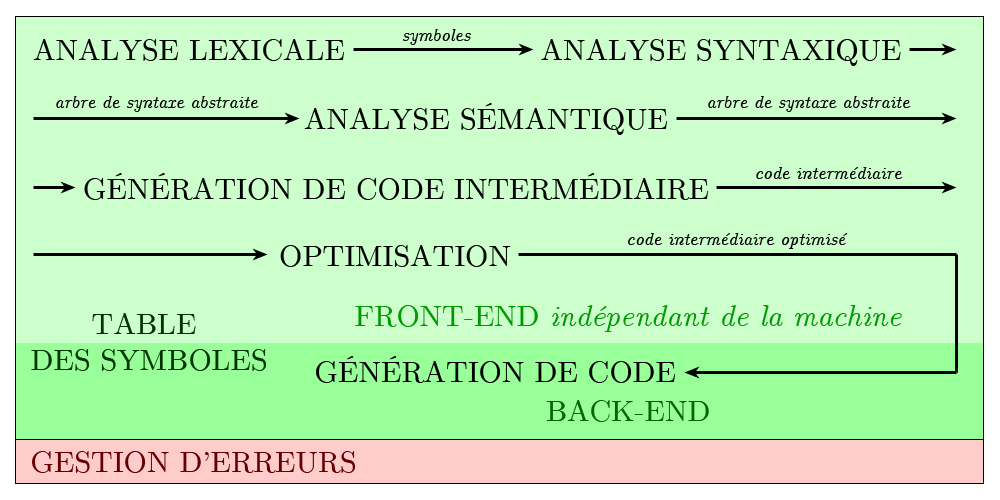
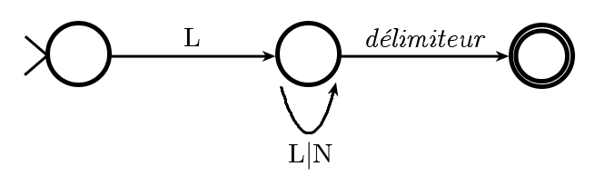
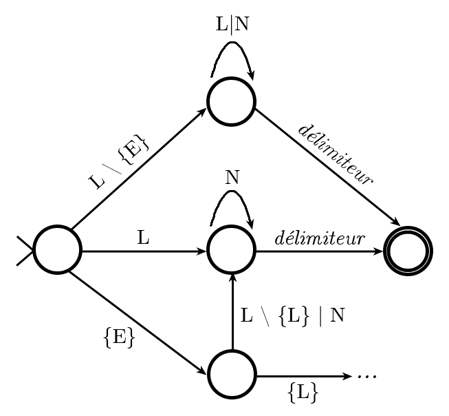
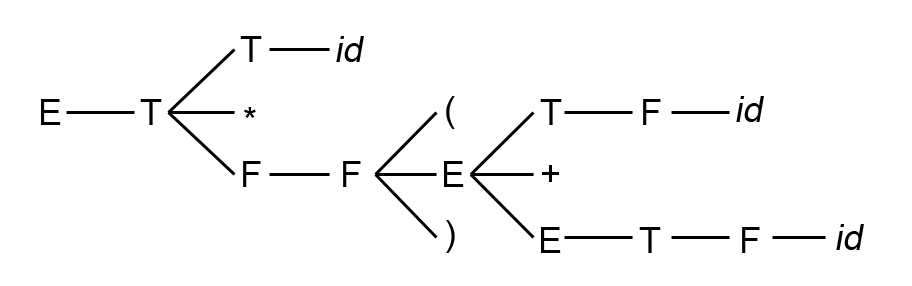
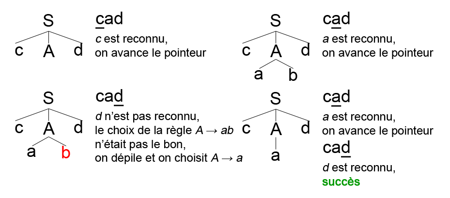
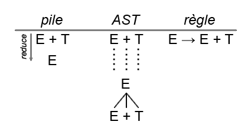

# Compilation

Mise en forme par [Marek Felsoci](mailto:marek.felsoci@etu.unistra.fr).

**L'USAGE DE CE RÉSUMÉ DE COURS NE PEUT ÊTRE QU'ACADÉMIQUE**

## Crédits

Ce résumé s'appuie sur les notes du cours de Compilation dispensé par Philippe CLAUSS à l'Université de Strasbourg.

## Introduction

> Langage de haut niveau &rarr; Compilation (tous les mécanismes de traduction et de transformation et les mécanismes utilisés dans d'autres contextes) &rarr; Langage machine

### Langage intermédiaire

C'est une forme propre à un compilateur comme par exemple *GIMPLE* et *GENERIC* utilisés par *GCC*, *LLVM IR* utilisé par *CLANG* ou encore *BYTECODE* utilisé par *Java VM*.

### Langage d'assemblage

C'est une représentation du code machine à l'aide des symboles mnémoniques traduite à l'aide d'un assembleur.

### Applications de type &laquo; compilation &raquo;

* **interpréteur** : traduction à la volée des instructions en langage source, lors de l'exécution
* **machine virtuelle** : interprète les instructions et compile à la volée celles qui sont souvent utilisées
* **compilateur statique** : tout le programme est compilé avant d'être exécuté (*gcc*, *clang*)

### Niveau de compréhension de texte d'entrée

1. On appelle une **analyse lexicale** la reconnaissance de mots dans le texte d'entrée selon une lexique. Les mots reconnus sont alors appelés des unités lexicales, symboles ou encore *tokens*
2. **L'analyse syntaxique** représente la vérification de la structure du texte et sa conformité par rapport à une syntaxe définie par une grammaire.
3. Enfin, la compréhension du sens du texte se fait lors de **l'analyse sémantique**.

### Structure de compilateur

La compilation comprend six phases principales :



La table des symboles contient une entrée par identificateur plus les informations liées (type, valeur numérique, valeur lexicale, etc.)

## Analyse lexicale

Cette pahse est effectuée par un **analyseur lexical** qui prend en entrée une suite de caractères et en produit une suite de *tokens*. Comme par exemple des mots clés, délimiteurs, identificateur, constantes, opérateurs, etc.

### Implémentation d'analyseur lexical

La description des unités lexicales se fait à l'aide des expressions rationnelles permettant de les reconnaître par des automates à états finis. L'exécution d'actions liées à la reconnaissance de *tokens* est en fait une association d'actions sous forme de programmes.

### Communication avec l'analyseur syntaxique

Deux possibilités existent pour faire communiquer l'analyseur syntaxique avec l'analyseur lexical. Soit ce dernier est une entité séparée et produit une liste de *tokens* soit les deux analyseurs forment une seule entité.


### Types de *tokens*

Les *tokens* peuvent être définis uniquement par un type :

* opérateur d'affectation
* opérateur d'addition
* mot réservé

Mais aussi par un type et une valeur :

* identificateur avec comme valeur son nom (en général une valeur correspond à un pointeur vers la table des symboles)
* entier avec sa valeur

### Description de *tokens*

Différentes façon sont possibles :

* expressions rationnelles
* automates déterministes

***Exemple***

Reconnaissance d'un identificateur qui est une lettre suivie de lettres ou de chiffres :

Soit *L* l'ensemble de lettres et *N* l'ensemble de chiffres. Alors l'expression rationnelle correspondante est *L*(*L*|*N*)<sup>\*</sup>. Cette dernière décrit l'automate suivant :



Si maintenant on veut reconnaître également des constantes entières ainsi que le mot clé &laquo; ELSE &raquo; :



Les mots clés sont traités comme des identificateurs en ayant été au préalable installés dans la table des symboles. Lors de la reconnaissance d'un mot clé une entrée correspondate existera déjà dans la table des symboles. Ainsi il n'y a plus besoin de traitement particulier pour les mots clés.

### Générateur d'analyseur lexical

On fournit au générateur une description des *tokens* (expressions rationnelles) ainsi que des actions liées aux *tokens* (écriture des instructions à exécuter).

Par exemple, pour le langage C on outilise le générateur *LEX*.

## Analyse syntaxique

L'analyse syntaxique a pour but de :

* assurer la conformité d'une suite de *tokens* par rapport à une grammaire
* effectuer une exhibition de la hiérarchie du texte en établissant un arbre de syntaxe abstraite
* repérer et éventuellement corriger des erreurs
* accéder à la table des symboles
* vérifier les types

***Exemple d'arbre de syntaxe abstraite***

Soit la suite de *tokens* suivante :

> ID AFF(ID PLUS(ID MULT CST))

Voici alors l'arbre de syntaxe abstraite correspondant :


De plus elle génère le code intermédiaire que l'on appelle aussi le code à trois adresses. C'est le code pour machine abstraite défini comme une séquence d'instructions qui ont au plus trois opérandes.

Il existe deux classes de méthode d'analyse syntaxique :

* les méthodes **descendantes** ou *top-down parsing*
* les méthodes **ascendantes** ou *bottom-up parsing* notamment utilisées par les générateurs d'analyseurs syntaxiques

***Exemple de grammaire***

Soit une grammaire *G<sub>0</sub>* décrivant les expressions arithmétiques :

> E &rarr; E + T | T  
> T &rarr; T \* F | F  
> F &rarr; (E) | *id*

Notons que les symboles terminaux sont en minuscules tandisque les symboles non-terminaux sont en majuscules.

### Analyse syntaxique descendante

La méthode descdendate a une représentation d'un arbre allant de la racine jusqu'aux feuilles. Elle est basée sur les **dérivations gauches** de *tokens* d'entrée. Il s'agit de remplacer le symbole terminal se trouvant le plus à gauche.

***Exemples d'analyse descedante***

Soit *(id + id)* \* *id* l'expression d'entrée. Alors la liste d'opérations de construction sera comme suit :

*g*E &rArr; *g*T &rArr; *g* \* F &rArr; *g*F \* F &rArr; *g*(E) \* F &rArr; *g*(E + T) \* F &rArr; *g*(T + T) \* F &rArr; *g*(F + T) \* F &rArr; *g*(*id* + T) \* F &rArr; *g*(*id* + F) \* F &rArr; *g*(*id* + *id*) \* F &rArr; *g*(*id* + *id*) \* *id*

Voici l'arbre de syntaxe abstraite résultant :



Prenons maintenant la grammaire suivante :

> S &rarr; cAd  
> A &rarr; ab | a

Voici le déroulement de l'analyse de la chaîne *cad* et la construction de l'arbre de syntaxe abstraite :



#### Problème des retours en arrière

Les retours an arrière lors de l'analyse sont très coûteux. Ces derniers sont dûs à des règles de la forme *A &rarr; &alpha;&Beta;<sub>1</sub> | ... | &alpha;&Beta;<sub>n</sub>* avec le même début en partie droite parmi lesquelles l'analyseur ne sait pas choisir.

Ces règles peuvent être supprimées à l'aide de la **factorisation à gauche** comme suit :

> A &rarr; &alpha;A'  
> A' &rarr; &Beta;<sub>1</sub> | ... | &Beta;<sub>n</sub>

#### Problème de la récursivité à gauche

La récursivité à gauche risque de provoquer des bouclages infinis qui sont alors dûs à la présence de règles récursives à gauche. La récursivité peut être :

* **directe** : *A &rarr; A&alpha;*
* **indirecte** : *A &rarr; B&alpha;* et *B &rarr; A&beta;*

Dans le cas simple il est possible de dérécursiver une règle de la forme *A &rarr; A&alpha; | &Beta;* en la séparant en deux règles telles que *A &rarr; &Beta;A'* et *A' &rarr; &alpha;A' | &epsilon;*.

Si on généralise alors tout règle de la forme *A &rarr; A&alpha;<sub>1</sub> | ... | A&alpha;<sub>n</sub> | &Beta;<sub>1</sub> | ... | &Beta;<sub>k</sub>* peut être transformée en :

> A &rarr; &Beta;<sub>1</sub>A' | ... | &Beta;<sub>k</sub>A'  
> A' &rarr; &alpha;<sub>1</sub>A' | ... | &alpha;<sub>m</sub>A' | &epsilon;

***Exemple de la dérécursivation de grammaire***

Reprenons la grammaire *G<sub>0</sub>* des expressions arithmétiques :

> E &rarr; E + T | T  
> T &rarr; T \* F | F  
> F &rarr; (E) | *id*

Après la dérécursivation décrite plus haut on obtient la grammaire équivalente suivante :

> E &rarr; TE'  
> E' &rarr; +TE' | &epsilon;  
> T &rarr; FT'  
> T' &rarr; \*FT' | &epsilon;  
> F &rarr; (E) | *id*

Pour éliminer des récursivités indirectes l'idée est pour toutes les règles de la forme *A &rarr; B&alpha;* et *B &rarr; A&Beta;* d'anticiper les règles problématiques *A &rarr; A&Beta;&alpha;* puis éliminer la récursivité directe avec la méthode précédente.

Dans le cas général on applique l'algorithme suivant :

```
Soit A[1] | ... | A[n] une liste ordonnée des symboles non-terminaux.

POUR i DE 1 À n FAIRE
    POUR j DE 1 À n-1 FAIRE
        SI A[i] --> A[j]a existe ALORS
            remplacer la règle par A[i] --> B[1]a | ... | B[m]a avec A[j] --> B[1] | ... | B[m]
        FIN SI
    FIN POUR    
    éliminer la récursivité directe
FIN POUR    
```

#### Problème de coût

L'algorithme précédant est coûteux comme il implique la recherche des règles applicables ainsi que des opérations de modification de l'arbre.

La première solution est l'analyse par descente récursive.

***Exemple***

Prenons la grammaire suivante :

> S &rarr; cAd  
> A &rarr; ab | a

```
FONCTION S {
    match(c); A; match(d);
}

FONCTION A {
    match(a);
    SI token_courant == b ALORS
        match(b);
    FIN SI    
}

FONCTION match(t) {
    SI token_courant == t ALORS
        token_courant = token_suivant;
    SINON
        erreur;
    FIN SI;
}
```

La deuxième solution est l'utilisation d'une pile comme dans l'**analyse itérative LL(1)**.

### Analyse LL(1)

Le premier L de l'appelation LL(1) signifie l'analyse à droite, le deuxième L indique la dérivation à gauche et le 1 veut dire que l'on lit un *token* d'avance.

Les principes de cette méthode sont les suivants :

* utilisation d'un pointeur sur le *token* courant
* terminaison de la chaîne d'entrée par $
* utilisation des symboles terminaux et non-terminaux dans la pile
* utilisation d'une table d'analyse *T*

La table d'analyse contient une ligne par symbole terminal ou non-terminal. On notera *T[A, a]* la règle de grammaire à appliquer lorsque *A* est au somment de la pile et *a* est le *token* courant. Ensuite à chaque itération on applique l'algorithme suivant :

```
SI le sommet X est un terminal ALORS
    SI X == token_courant == $ ALORS
        terminer avec succès
    SINON SI X == token_courant != $ ALORS
        dépiler X et avancer le pointeur
    SINON  
        erreur
    FIN SI
SINON SI X est un non-terminal ALORS
    SI T[X, token_courant] == {X --> Y[1]...Y[n]} ALORS
        on dépile X et on empile la prtie droite de la règle dans l'ordre inverse Y[n]...Y[1]
    SINON SI T[X, token_courant] est vide ALORS
        erreur
    FIN SI
FIN SI
```

***Exemple d'analyse LL(1)***

Reprenons la grammaire *G<sub>0</sub>* dérécursivée des expressions arithmétiques :

> E &rarr; TE'  
> E' &rarr; +TE' | &epsilon;  
> T &rarr; FT'  
> T' &rarr; \*FT' | &epsilon;  
> F &rarr; (E) | *id*

Soit la table d'analyse suivante :

|     |      *id*       |           +           |        \*         |       (        |           )           |           $           |
|-----|-----------------|-----------------------|-------------------|----------------|-----------------------|-----------------------|
|  E  |  E &rarr; TE'   |                       |                   |  E &rarr; TE'  |                       |                       |
|  E' |                 |     E &rarr; +TE'     |                   |                |  E' &rarr; &epsilon;  |  E' &rarr; &epsilon;  |
|  T  |  T &rarr; FT'   |                       |                   |  T &rarr; FT'  |                       |                       |
|  T' |                 |  T' &rarr; &epsilon;  |  T' &rarr; \*FT'  |                |  T' &rarr; &epsilon;  |  T' &rarr; &epsilon;  |
|  F  |  F &rarr; *id*  |                       |                   |  F &rarr; (E)  |                       |                       |

Analysons l'expression *id* + *id* \* *id* :

|    Pile     |    Chaîne d'entrée     |
|-------------|------------------------|
|     $E      |  *id* + *id* \* *id*$  |
|    $E'T     |  *id* + *id* \* *id*$  |
|   $E'T'F    |  *id* + *id* \* *id*$  |
|  $E'T'*id*  |                        |
|    $E'T'    |     +*id* \* *id*$     |
|     $E'     |     +*id* \* *id*$     |
|    $E'T+    |                        |
|     $E'T    |     *id* \* *id*$      |
|   $E'T'F    |                        |
|  $E'T'*id*  |                        |
|    $E'T'    |        \**id*$         |
|  $E'T'F\*   |                        |
|   $E'T'F    |         *id*$          |
|  $E'T'*id*  |                        |
|    $E'T'    |           $            |
|     $E'     |           $            |
|      $      |           $            |

#### Table d'analyse

Avant de pouvoir construire la table d'analyse il faut déterminer deux ensembles associés à la grammaire qui sont l'ensemble *First* et l'ensemble *Follow*. Pour la suite nous allons utiliser une chaîne de terminaux et non-terminaux *&alpha;* et un non-terminal *A*.

*First* représente l'ensemble des symboles terminaux qui peuvent se trouver au début des dérivations de *&alpha;*. D'autre part l'ensemble *Follow* contient des symboles terminaux qui peuvent se trouver juste après *A* dans une des dérivations.

Soit une grammaire *G* = (*V*, *&Sigma;*, *R*, *S*) où *V* est l'ensemble de non-terminaux, *&Sigma;* l'ensemble des terminaux, *R* les règles et *S* le symbole le plus général. Nous avons alors :

> *First*(&alpha;) = { a &isin; &Sigma; | &exist; &beta; &isin; (V &cup; &Sigma;)<sup>*</sup>, &alpha; &rArr;<sup>*</sup> a&beta; }  
> *Follow*(A) = { a &isin; &Sigma; | &exist; &alpha;, &beta; &isin; (V &cup; &Sigma;)<sup>*</sup>, S &rArr;<sup>*</sup> &alpha;Aa&beta; } &cup; { $, si &exist; &alpha; &isin; (V &cup; &Sigma;)<sup>*</sup>, S &rArr; &alpha;A }<sub>si A est à la fin de chaîne on inclut aussi $</sub>

#### Calcul de l'ensemble *First*

Soit *a* un symbole terminal quelcoonque.

* *First*(x) :
    * si x &isin; &Sigma; alors *First*(x) = { x }
    * si x &isin; *V* alors : pour toutes les règles de la forme X &rarr; Y<sub>1</sub>...Y<sub>n</sub> ajouter *a* si &exist; *i* &isin; [1...n] | &epsilon; &isin; (*First*(Y<sub>1</sub>) &cap; ... &cap; *First*(Y<sub>i - 1</sub>)) et *a* &isin; *First*(Y<sub>i</sub>)
* *First*(x<sub>1</sub>...x<sub>n</sub>) :
    * ajouter tous les terminaux de *First*(x<sub>1</sub>)
    * ajouter tous les terminaux de *First*(x<sub>2</sub>) &hArr; &epsilon; *First*(x<sub>1</sub>)
    * ajouter tous les terminaux de *First*(x<sub>3</sub>...x<sub>n</sub>) &hArr; &epsilon; &isin; (*First*(x<sub>1</sub>) &cap; ... &cap; *First*(x<sub>n - 1</sub>))

***Exemple de calcul de First***

Reprenons la grammaire *G<sub>0</sub>* dérécursivée des expressions arithmétiques :

> E &rarr; TE'  (si T pouvait se dériver en &epsilon; on devrait vérifier aussi E)
> E' &rarr; +TE' | &epsilon;  
> T &rarr; FT'  (T ne commence pas par un terminal mais il faut regarder toutes les dérivations possibles de T donc on vérifie F)
> T' &rarr; \*FT' | &epsilon;  
> F &rarr; (E) | *id*

*First*(F) = {(, *id*}  
*First*(T') = {\*, &epsilon;}  
*First*(T) = {(, *id*} = *First*(F)  
*First*(E') = {+, &epsilon;}  
*First*(E) = {(, *id*} = *First*(F)

#### Calcul de l'ensemble *Follow*

* En premier, il faut inclure $ dans *Follow*(S).
* S'il existe une règle de la forme A &rarr; &alpha;B&beta; alors on ajoute *First*(&beta;) - {&epsilon;} à *Follow*(B).
* S'il existe une règle de grammaire de la forme A &rarr; &alpha;B ou de la forme A &rarr; &alpha;B&beta; avec &epsilon; &isin; *First*(&beta;) alors on ajoute *Follow*(A) à *Follow*(B).

***Exemple de calcul de Follow***

Reprenons la grammaire *G<sub>0</sub>* de l'exemple précédent :

Nous allons rechercher les règles où E apparait ) droite de quelque chose.

*Follow*(E) = {), $} car E = S  
*Follow*(E') = {), $} = *Follow*(E)
*Follow*(T) = {+, ), $}
*Follow*(T') = {+, ), $} = *Follow*(T) (T' va être réduit en T donc tout ce qui suit T' suit aussi T)
*Follow*(F) = {\*, +, ), $} (&epsilon; &isin; T' donc tout ce qui suit F suit aussi T)

#### Construction de la table d'analyse

Pour chaque règle de la forme A &rarr; &alpha; affecter A rarr; &alpha; à T[A, a] pour tout *a* appartenant à *First*(&alpha;) - {&epsilon;}. Si &epsilon; appartient à *First*(&alpha;) affecter &alpha; à T[A, b] pour tout *b* appartenant à *Follow*(A).

|     |      *id*       |           +           |        \*         |       (        |           )           |           $           |
|-----|-----------------|-----------------------|-------------------|----------------|-----------------------|-----------------------|
|  E  |  E &rarr; TE'   |                       |                   |  E &rarr; TE'  |                       |                       |
|  E' |                 |     E &rarr; +TE'     |                   |                |  E' &rarr; &epsilon;  |  E' &rarr; &epsilon;  |
|  T  |  T &rarr; FT'   |                       |                   |  T &rarr; FT'  |                       |                       |
|  T' |                 |  T' &rarr; &epsilon;  |  T' &rarr; \*FT'  |                |  T' &rarr; &epsilon;  |  T' &rarr; &epsilon;  |
|  F  |  F &rarr; *id*  |                       |                   |  F &rarr; (E)  |                       |                       |

**Remarque :** S'il y a plus qu'une règle par case de la table alors la grammaire est **ambiguë** !

### Analyse syntaxique ascendante

La méthode descdendate a une représentation d'un arbre allant des feuilles jusqu'à la racine. Elle est basée sur les **dérivations droites** de *tokens* d'entrée. Il s'agit de remplacer le symbole terminal se trouvant le plus à droite.

***Exemple d'analyse ascedante***

Soit *(id + id)* \* *id* l'expression d'entrée. Alors la liste d'opérations de construction sera comme suit :

*g*(*id* + *id*) \* *id* &rArr; *g*(*id* + *id*) \* F &rArr; *g*(*id* + F) \* F &rArr; *g*(*id* + T) \* F &rArr; *g*(F + T) \* F &rArr;  *g*(T + T) \* F &rArr; *g*(E + T) \* F &rArr; *g*(E) \* F &rArr; *g*F \* F &rArr; *g* \* F &rArr; *g*T &rArr; *g*E

Voici l'arbre de syntaxe abstraite résultant :


À chaque étape on examine le sommet de la pile en prenant en compte plusieurs de ses éléments à la fois. Ces éléments au sommet doivent correspondre au préfixe des parties droites d'une ou de plusieurs règles de grammaires. C'est ce que l'on appelle un **préfixe viable**. Au cas où aucun préfixe ne correspond au sommet on effectue l'action ***shift*** qui correspond à l'empilement du *token* courant et l'avancement du pointeur sur la chaîne d'entrée. Au cas où une partie droite correspond au sommet on effectue à la fois les actions ***shift*** et ***reduce***. Autrement dit, on dépile tous les éléments correspondant à la partie droite et on empile le symbole de la partie gauche.

***Exemple***



On procède par retours-arrière éventuels jusqu'à ce qu'il ne reste plus que S dans la pile et plus de *tokens* à l'entrée.

***Exemple***

Reprenons la grammaire G<sub>0</sub> sans multiplication :

> E &rarr; E + T
> E &rarr; T
> T &rarr; (E)
> T &rarr; *id*

|pile|chaîne d'entrée|action|règle|
|---|---|---|---|
||*id* + (*id* + *id*)|*shift*||
|*id*|+ (*id* + *id*)|*reduce*|T &rarr; *id*|
|T|+ (*id* + *id*)|*reduce*| E &rarr; T|
|E|+ (*id* + *id*)|*shift*||
|E+|(*id* + *id*)|*shift*||
|E+(|*id* + *id*)|*shift*||
|E+(*id*|+ *id*)|*reduce*|T &rarr; *id*|
|E+(T|+ *id*)|*reduce*|E &rarr; T|
|E+(E|+ *id*)|*shift*||
|E+(E+|*id*)|*shift*||
|E+(E+*id*|)|*reduce*|T &rarr; *id*|
|E+(E+T|)|*reduce*|E &rarr; E + T|
|E+(E|)|*shift*||
|E+(E)||*reduce*|T &rarr; (E)|
|E+T||*reduce*|E &rarr; E + T|
|E||||

#### Problèmes à résoudre

* Comment choisir entre *shift* et *reduce* ?
* Comment choisir entre plusieurs *reduce* ?

#### Solution

L'analyseur doit non seulement prendre en compte le *token* courant et le sommet de la pile mais également tout le reste de la pile. Cette stratégie implique l'utilisation d'états qui représentent toute la pile et donc les situations que l'on peut rencontrer au niveau de la pile au cours d'analyse. Voir **L'analyse LR** (*Left-to-right*, *Rightmost*).

#### Analyse LR

Ce type d'analyse implique l'utilisation d'un pointeur sur la chaîne d'entrée suffixée par $ ainsi que d'une pile avec des états décrivant le contenu de la pile qui est de la forme S<sub>0</sub>X<sub>0</sub>S<sub>1</sub>X<sub>1</sub>...X<sub>m - 1</sub>S<sub>m</sub> où S est un état et X un symbole terminal ou non-terminal ou encore $.

Analyse LR utilise également une table d'analyse ayant deux parties.

La partie *ACTION* comprend une ligne par état et une colonne par symbole terminal. Ainsi *ACTION*[S<sub>i</sub>, a] peut contenir :

* *shift* S<sub>j</sub> où S<sub>j</sub> est un état : on empile *a* puis S<sub>j</sub> et on avance le pointeur
* *reduce* *r*<sub>k</sub> où *k* est le numéro d'une règle : soit A &rarr; &beta; la k<sup>e</sup> règle et soit L la longueur de &beta; alors on dépile L éléments, on empile A et on empile l'état *GOTO*[S<sub>i</sub>, A] où S<sub>i</sub> est l'état courant
* *accept*
* erreur

La partie *GOTO* comprend une ligne par état et une colonne par symbole non-terminal. Ainsi *GOTO*[S<sub>i</sub>, A] contient le nouvel état à empiler.

#### Analyse SLR

C'est la version simplifiée de l'analyse LR.

***Grammaire augmentée***

Il s'agit du remplacement de la grammaire G par une grammaire G' telle que G' = (V &cup; {S'}, &Sigma;, R &cup; {S' &rarr; S}, S').

***Règle pointée***

C'est l'utilisation d'un point dans la partie droite des règles afin de représenter ce qui a déjà été reconnu par l'analyse autrement dit ce qui a déjà passé par le sommet de la pile (A &rarr; &alpha; . &beta;).

***État***

L'état est représenté par un ensemble de règles pointées susceptibles d'être appliquées dans la suite de l'analyse avec le même préfixe viable.

***Construction de l'état initial***

Pour construire l'état initial on utilise une opération de *fermeture* sur les règles pointées.

Si A &rarr; &alpha; . B&beta; appartient à l'état S alors on s'attend à rencontrer une sous-chaîne dérivable à partir de B&beta;. Donc s'il existe une règle B &rarr; &gamma; alors on s'attend à rencontrer une sous-chaîne dérivable à partir de &gamma;. B &rarr; . &gamma; doit appartenir à l'état S.

L'opération de *fermeture* consiste à ajouter à un état S toutes les règles pointées qui doivent s'y trouver. L'état initial est égal à la fermeture de {S' &rarr; .S} où S est la règle la plus générale de la grammaire augmentée.

***Exemple***

Soit G<sub>0</sub> une grammaire augmentée composée des règles suivantes :

> E' &rarr; E  
> E &rarr; E + T  
> E &rarr; T  
> T &rarr; T \* F  
> T &rarr; F  
> F &rarr; (E)  
> F &rarr; *id*

L'état initial S<sub>0</sub> est égal à la *fermeture*({E' &rarr; .E}) qui correspond à {E' &rarr; .E, E &rarr; .E + T, E &rarr; .T, T &rarr; .T \* F, T &rarr; .F, &rarr; .(E), F &rarr; .*id*}.

***Construction des états suivants***

Dans cette phase on utilise l'opération *GOTO*. L'idée est que si S est un état qui correspond à un préfixe viable &alpha; alors *GOTO*(S, X) est un état qui correspond au préfixe viable &alpha;X. *GOTO*(S, X) est égal à la fermeture de toutes les règles de la forme A &rarr; &alpha;X.&beta; et telles que A &rarr; &alpha;.X&beta; &isin; S.

***Exemple***

En reprenant l'exemple précédent on calcule les états suivants comme suit :

s<sub>1</sub> = *GOTO*(s<sub>0</sub>, E) = {E' &rarr; E., E &rarr; E. + T} (pas de *fermeture* à appliquer étant donné que le point est suivi de &epsilon; et d'un non-terminal)

s<sub>2</sub> = *GOTO*(s<sub>0</sub>, T) = {E &rarr; T., T &rarr; T. \* F}

s<sub>3</sub> = *GOTO*(s<sub>0</sub>, F) = {T &rarr; F.}

s<sub>4</sub> = *GOTO*(s<sub>0</sub>, &laquo; ( &raquo;) = {F &rarr; (.E), E &rarr; .E + T, E &rarr; .T, T &rarr; .T \* F, T &rarr; .F, F &rarr; .(E), F &rarr; .*id*}

s<sub>5</sub> = *GOTO*(s<sub>0</sub>, *id*) = {F &rarr; *id*}

s<sub>6</sub> = *GOTO*(s<sub>1</sub>, +) = {E &rarr; E +. T, T &rarr; .T \* F, T &rarr; .F, F &rarr; .(E), F &rarr; .*id*}

s<sub>7</sub> = *GOTO*(s<sub>2</sub>, \*) = {T &rarr; T \*. F, F &rarr; .(E), F &rarr; .*id*}

s<sub>8</sub> = *GOTO*(s<sub>4</sub>, E) = {F &rarr; (E.), E &rarr; E. + T}

s<sub>9</sub> = *GOTO*(s<sub>6</sub>, T) = {E &rarr; E + T., T &rarr; T. \* F}

s<sub>10</sub> = *GOTO*(s<sub>7</sub>, F) = {T &rarr; T \* F.}

s<sub>11</sub> = *GOTO*(s<sub>8</sub>, &laquo; ) &raquo;) = {F &rarr; (E).}

***Construction de la table d'analyse***

La partie *ACTION* :

* Si A &rarr; &alpha;.a&beta; &isin; s<sub>i</sub> alors *ACTION*[s<sub>i</sub>, a] = *shift* s<sub>j</sub> où s<sub>j</sub> = *GOTO*(s<sub>i</sub>, a).
* Si A &rarr; &alpha;. &isin; s<sub>i</sub> et si A &notin; s' alors *ACTION*[s<sub>i</sub>, a] = *reduce* r<sub>k</sub> où *k* est le numéro de la règle A &rarr; &alpha; et &forall;*a* &isin; *Follow*(A).
* Si S' &rarr; S &isin; s<sub>i</sub> alors *ACTION*[s<sub>i</sub>, $] = *accept*.

La partie *GOTO* :

* *GOTO*(s<sub>i</sub>, A) = s<sub>j</sub> où s<sub>j</sub> est un état obtenu en appliquant l'opération *GOTO*(s<sub>i</sub>, A).
