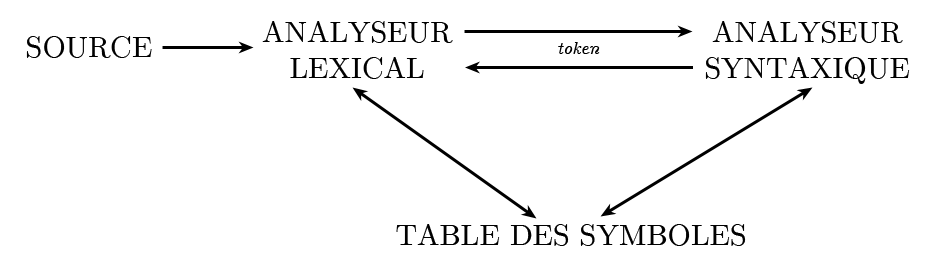
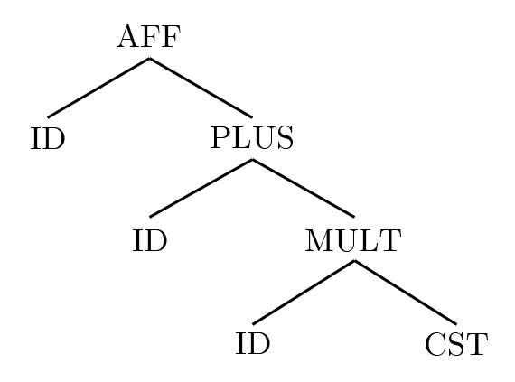

# Compilation

## À propos

Ce document reprend les notes du cours de Compilation dispensées par [**M Philippe CLAUSS**](http://icps.u-strasbg.fr/~clauss/) à *l'Université de Strasbourg*.

Mise en forme par [Marek Felsoci](mailto:marek.felsoci@etu.unistra.fr).

**ATTENTION !** L'USAGE DE CE RÉSUMÉ DE COURS NE PEUT ÊTRE QU'ACADÉMIQUE.

## 1 Introduction

> Langage de haut niveau &rarr; Compilation (tous les mécanismes de traduction et de transformation et les mécanismes utilisés dans d'autres contextes) &rarr; Langage machine

### 1.1 Langage intermédiaire

C'est une forme propre à un compilateur comme par exemple *GIMPLE* et *GENERIC* utilisés par *GCC*, *LLVM IR* utilisé par *CLANG* ou encore *BYTECODE* utilisé par *Java VM*.

### 1.2 Langage d'assemblage

C'est une représentation du code machine à l'aide des symboles mnémoniques traduite à l'aide d'un assembleur.

### 1.3 Applications de type &laquo; compilation &raquo;

* **interpréteur** : traduction à la volée des instructions en langage source, lors de l'exécution
* **machine virtuelle** : interprète les instructions et compile à la volée celles qui sont souvent utilisées
* **compilateur statique** : tout le programme est compilé avant d'être exécuté (*gcc*, *clang*)

### 1.4 Niveau de compréhension de texte d'entrée

1. On appelle une **analyse lexicale** la reconnaissance de mots dans le texte d'entrée selon une lexique. Les mots reconnus sont alors appelés des unités lexicales, symboles ou encore &laquo; tokens &raquo;
2. **L'analyse syntaxique** représente la vérification de la structure du texte et sa conformité par rapport à une syntaxe définie par une grammaire.
3. Enfin, la compréhension du sens du texte se fait lors de **l'analyse sémantique**.

## 2 Structure de compilateur

La compilation comprend six phases principales :

La table des symboles contient une entrée par identificateur plus les informations liées (type, valeur numérique, valeur lexicale, etc.)

### 2.1 Analyse lexicale

L'opération est effectuée par un **analyseur lexical** qui prend en entrée une suite de caractères et en produit une suite de &laquo; tokens &raquo;. Comme par exemple des mots clés, délimiteurs, identificateur, constantes, opérateurs, etc.

### 2.2 Implémentation d'analyseur lexical

La description des unités lexicales se fait à l'aide des expressions rationnelles permettant de les reconnaître par des automates à états finis. L'exécution d'actions liées à la reconnaissance de &laquo; tokens &raquo; est en fait une association d'actions sous forme de programmes.

### 2.3 Communication avec l'analyseur syntaxique

Deux possibilités existent pour faire communiquer l'analyseur syntaxique avec l'analyseur lexical. Soit ce dernier est une entité séparée et produit une liste de &laquo; tokens &raquo; soit les deux analyseurs forment une seule entité.

### 2.4 Types de &laquo; tokens &raquo;

Les &laquo; tokens &raquo; peuvent être définis uniquement par un type :

* opérateur d'affectation
* opérateur d'addition
* mot réservé

Mais aussi par un type et une valeur :

* identificateur avec comme valeur son nom (en général une valeur correspond à un pointeur vers la table des symboles)
* entier avec sa valeur

### 2.5 Description de &laquo; tokens &raquo;

Différentes façon sont possibles :

* expressions rationnelles
* automates déterministes

#### Exemple

Reconnaissance d'un identificateur qui est une lettre suivie de lettres ou de chiffres :

Soit *L* l'ensemble de lettres et *N* l'ensemble de chiffres. Alors l'expression rationnelle correspondante est *L*(*L*|*N*)\*. Cette dernière décrit l'automate suivant :

Si maintenant on veut reconnaître également des constantes entières ainsi que le mot clé &laquo; ELSE &raquo; :

Les mots clés sont traités comme des identificateurs en ayant été au préalable installés dans la table des symboles. Lors de la reconnaissance d'un mot clé une entrée correspondate existera déjà dans la table des symboles. Ainsi il n'y a plus besoin de traitement particulier pour les mots clés.

### 2.6 Générateur d'analyseur lexical

On fournit au générateur une description des &laquo; tokens &raquo; (expressions rationnelles) ainsi que des actions liées aux &laquo; tokens &raquo; (écriture des instructions à exécuter).

Par exemple, pour le langage C on outilise le générateur *LEX*.

### 2.7 Analyse syntaxique

Son but est d'assurer la conformité d'une suite de &laquo; tokens &raquo; par rapport à une grammaire. Il effectue une exhibition de la hiérarchie du texte en établissant un arbre de syntaxe abstraite.

#### Exemple

Soit la suite de &laquo; tokens &raquo; suivante :

> ID AFF(ID PLUS(ID MULT CST))

Voici alors l'arbre de syntaxe abstraite correspondant :

### 2.8 Génération de code intermédiaire

Ce code correspond au code pour machine abstraite. Comme il est représenté par une séquence d'instructions qui ont au plus trois opérandes on l'appelle aussi le code à trois adresses 
