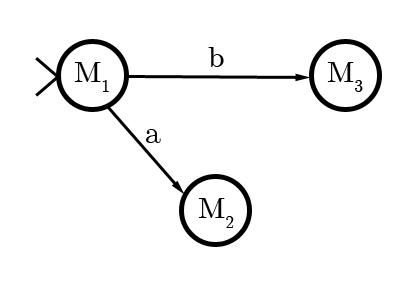

# Complexité et calculabilité

## À propos

Ce document reprend les notes du cours de Complexité et calculabilité dispensées par [**M Christian RONSE**](https://dpt-info.u-strasbg.fr/~cronse/welcome.html) à *l'Université de Strasbourg*.

Mise en forme par [Marek Felsoci](mailto:marek.felsoci@etu.unistra.fr).

**ATTENTION !** L'USAGE DE CE RÉSUMÉ DE COURS NE PEUT ÊTRE QU'ACADÉMIQUE.

## 1 Machines de Turing

### 1.1 Contrôle avec un nombre fini d'états

Les machines de Turing utilisent une bande ordonnée avec un début mais sans fin où on peut lire, écrire et se déplacer.

### 1.2 Mécanisme

En fonction de l'état du contrôle et du contenu de la case où se trouve la tête de lecture :

* on passe dans un (nouvel) état
  *et simultanément*
* la tête de lecture soit écrit un caractère dans la case et on ne change rien soit se déplace d'une case à droite ou à gauche

L'alphabet fini &Sigma; utilisé par l'automate contient :

* &#9655; : un symbole de début de bande
* &#8852; : un symbole de blanc
* autres symboles

Souvent l'alphabet &Sigma;0 en entrée/sortie &supe; &Sigma;. Les symboles &rarr; et &larr; codant le déplacement d'une case à droite respectivement à gauche n'appartiennent pas à &Sigma;.

### 1.3 Définition formelle

Une machine de Turing est un quintuplet (K, &Sigma;, &delta;, s, H) tel que :

* K est un ensemble fini d'états
* s est l'état initial et s &isin; K
* H est l'ensemble d'états d'arrêt et H &sube; K
* &Sigma; est un alphabet fini tel que {&#9655;, &#8852;} &isin; &Sigma; et {&rarr;, &larr;} &notin; &Sigma;
* &delta; est une transition qui correspond à (K - H) &times; &Sigma; &rarr; K &times; (&Sigma; &cup; {&rarr;, &larr;}) se traduisant par (q, a) &#8614; (p, b) où q &isin; (K - H), a &isin; &Sigma;, p &isin; K et b &isin; (&Sigma; &cup; {&rarr;, &larr;})

### 1.4 Contraintes

Soit &delta; une transition telle que &delta;(q, a) = (p, b).

* Si a = &#9655; alors b = &rarr;.
* Si a &ne; &#9655; alors b &ne; &#9655;.

### Example

Une machine de Turing effaçant la bande serait définie comme suit :

K = {q0, q1, h}  
s = q0  
H = {h}  
&Sigma; = {&#9655;, &#8852;, a}  
&delta; :

| q | &sigma; | &delta;(q, &sigma;) |
| --- | --- | --- |
| q0 | &#9655; | (q0, &rarr;) |
| q0 | &#8852; | (h, &#8852;) |
| q0 | a | (q1, &#8852;) |
| q1 | &#9655; | (q1, &rarr;)n'arrive jamais |
| q1 | &#8852; | (q0, &rarr;) |
| q1 | a | (q0, a) |

### 1.5 Configuration

Une configuration représente un couple composé de l'état et le contenu de la bande avec la position de la tête de lecture. Dans la notation (q, &#9655;&#8852; **m** o t) q représente l'état, &laquo; &#9655;&#8852; **m** o t &raquo; est le contenu de la bande jusqu'au dernier symbole différent de blanc et la tête de lecture est positionnée sur **m**.

Il est également possible d'utiliser un triplet (q, w, u) pour décrire une configuration où :

* q &isin; K
* w &isin; &#9655;&Sigma;&rarr;\*
* u &isin; &Sigma;&rarr;\*(&Sigma; - &#8852;)
* la tête de lecture est sur le caractère le plus à droite de *w*
* *u* est le mot à droite de la tête de lecture jusqu'au dernier caractère non-blanc

**Exemples :** (q, &#9655;&#8852; **m** o t) &hArr; (q, &#9655;&#8852; **m**, o t), (q, &#9655;&#8852; m o t &#8852; **&#8852;**) &hArr; (q, &#9655;&#8852; m o t &#8852; &#8852;, &epsilon;)

### 1.6 Transitions de configuration

Notons (q1, w1, a1, u1) &#8866;M (q2, w2, a2, u2) la transition de configuration entre deux états d'une machine de Turing *M* où q1 &isin; K - H et &delta;(q1, a1) = (q2, b).

Lorsqu'on veut déterminer *w2* et *u2* à partir de *b* il y a trois cas possibles :

1. b &isin; &Sigma; alors *w2* = *w1*, *u2* = *u1* et *a2* = *b*
2. b = &rarr; alors la tête de lecture se déplace d'un cran à droite, *w2* = *w1a1* et :
  * si *u1* = &Sigma; alors *a2* = &#8852; et *u2* = &epsilon;
  * sinon *u1* = *a2u2* &rArr; *a2* = tête de *u1* et *u2* = queue
3. b = &larr; alors la tête de lecture se déplace d'un cran à gauche, *w1* = *w2a2* où *a2* est le dernier caractère de *w1* et *w2* est le mot d'avant,
  * si *a1* = &#8852; et *u1* = &epsilon; alors *u2* = &epsilon;
  * sinon *u2* = *a1u1*

La fermeture transitive de configurations &#8866;M+ signifie qu'il est possible de passer de celle de gauche à celle de droite en un nombre *n* &gt; 0 de transitions.

D'autre part la fermeture réflexive et transitive de configurations &#8866;M\* signifie qu'il est possible de passer de celle de gauche à celle de droite en un nombre *n* &ge; 0 de transitions.

### 1.7 Composition

Une machine de Turing peut être contruite à partir des machines de Turing de base.

#### 1.7.1 Machines de Turing de base

Soit Ma une machine de Turing de base telle que :

* a &isin; &Sigma; &cup; {&rarr;, &larr;}
* K = {s, h}
* &delta;(s,  &#9655;) = (s, &rarr;)
* &delta;(s, x) = (h, a) où x &ne; &#9655;

Ma est alors une machine qui écrit la lettre *a* sur la bande.

Dans la suite on outilisera les abbréviations M&rarr; et M&larr; pour noter les machines de Turing qui déplacent la tête de lecture d'un cran à droite respectivement à gauche sur la bande.

#### 1.7.2 Combinaisons

##### Exemple

* On démarre avec M1.
* Si M1 se termine avec *a* sur la tête alors on va sur M2.
* Si M1 se termine avec *b* sur la tête alors on va sur M3.

##### Définition formelle

On décrit la combinaison des machines de Turing M1, ..., Mn comme suit :

> Mi = (Ki, &Sigma;, &delta;i, si, Hi)

> K = &#8899;ni = 1 Ki &cup; {h\*}

> s = si pour &gt;Mi

> H = {h\*}

Transitions :

> * celles des machines : &delta;i &supe; &#8899;ni = 1 &delta;i
> * entre les machines :
>   * Mi &rarr; Mj, &delta;(hi, &sigma;) = (sj, &sigma;) &and; &sigma; &isin; &Sigma; - {&#9655;}
>   * Mi &rarr;a Mj, &delta;(hi, a) = (sj, a)

> Si aucune flèche ne sort de Mi avec un *a* dessus alors &delta;(hi, a) = (h\*, a).
